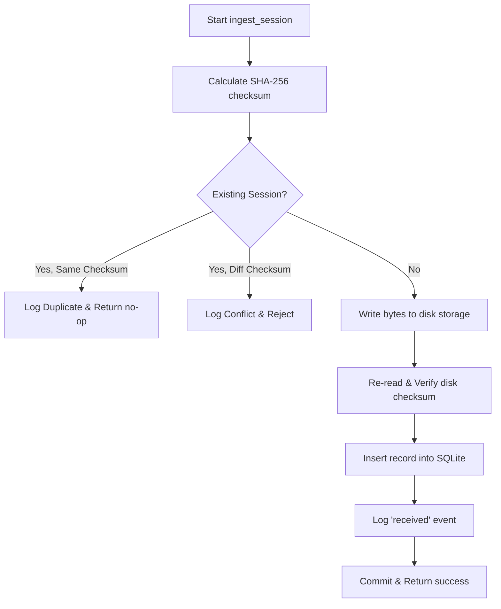

```mermaid
flowchart TD
    A[Start ingest_session] --> B[Calculate SHA-256 checksum]
    B --> C{Existing Session?}
    C -->|Yes, Same Checksum| D[Log Duplicate & Return no-op]
    C -->|Yes, Diff Checksum| E[Log Conflict & Reject]
    C -->|No| F[Write bytes to disk storage]
    F --> G[Re-read & Verify disk checksum]
    G --> H[Insert record into SQLite]
    H --> I[Log 'received' event]
    I --> J[Commit & Return success]
```