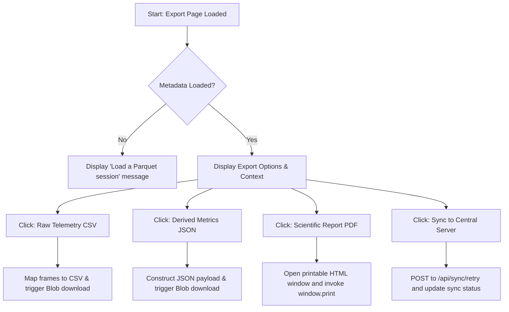

```mermaid
graph TD
    A[Start: Export Page Loaded] --> B{Metadata Loaded?}
    B -- No --> C[Display 'Load a Parquet session' message]
    B -- Yes --> D[Display Export Options & Context]
    
    D --> E1[Click: Raw Telemetry CSV]
    D --> E2[Click: Derived Metrics JSON]
    D --> E3[Click: Scientific Report PDF]
    D --> E4[Click: Sync to Central Server]
    
    E1 --> F1[Map frames to CSV & trigger Blob download]
    E2 --> F2[Construct JSON payload & trigger Blob download]
    E3 --> F3[Open printable HTML window and invoke window.print]
    E4 --> F4[POST to /api/sync/retry and update sync status]
```