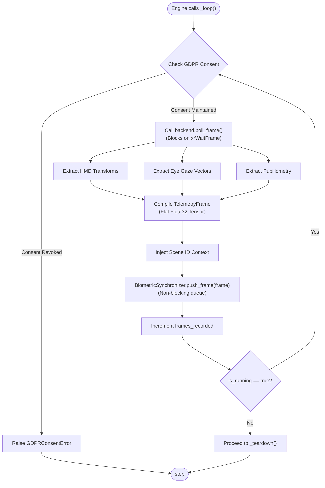

```mermaid
flowchart TD
    Start(["Engine calls _loop()"]) --> CheckGDPR{"Check GDPR Consent"}
    CheckGDPR -- "Consent Revoked" --> RaiseError["Raise GDPRConsentError"] --> Stop(["stop"])
    CheckGDPR -- "Consent Maintained" --> PollFrame["Call backend.poll_frame()<br/>(Blocks on xrWaitFrame)"]
    PollFrame --> ExtractHMD["Extract HMD Transforms"]
    PollFrame --> ExtractEye["Extract Eye Gaze Vectors"]
    PollFrame --> ExtractPupil["Extract Pupillometry"]
    ExtractHMD --> Compile["Compile TelemetryFrame<br/>(Flat Float32 Tensor)"]
    ExtractEye --> Compile
    ExtractPupil --> Compile
    Compile --> Context["Inject Scene ID Context"]
    Context --> Push["BiometricSynchronizer.push_frame(frame)<br/>(Non-blocking queue)"]
    Push --> Increment["Increment frames_recorded"]
    Increment --> CheckRunning{"is_running == true?"}
    CheckRunning -- Yes --> CheckGDPR
    CheckRunning -- No --> Teardown["Proceed to _teardown()"] --> Stop
```

