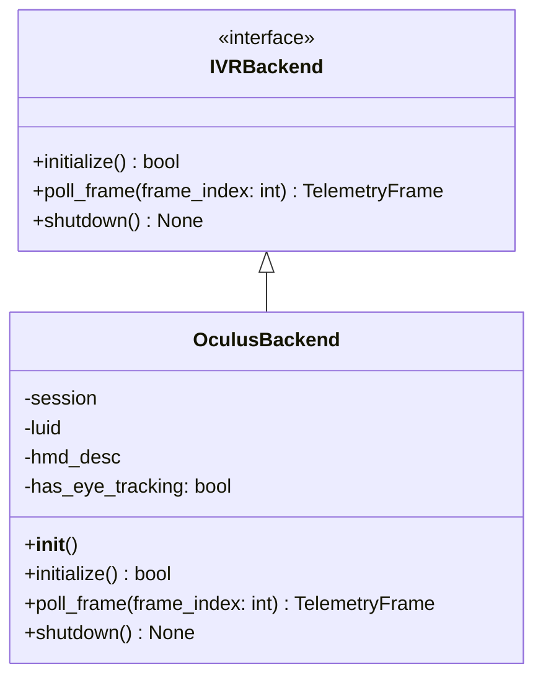

```mermaid
classDiagram
    class IVRBackend {
        <<interface>>
        +initialize() bool
        +poll_frame(frame_index: int) TelemetryFrame
        +shutdown() None
    }
    class OculusBackend {
        -session
        -luid
        -hmd_desc
        -has_eye_tracking: bool
        +__init__()
        +initialize() bool
        +poll_frame(frame_index: int) TelemetryFrame
        +shutdown() None
    }
    IVRBackend <|-- OculusBackend
```