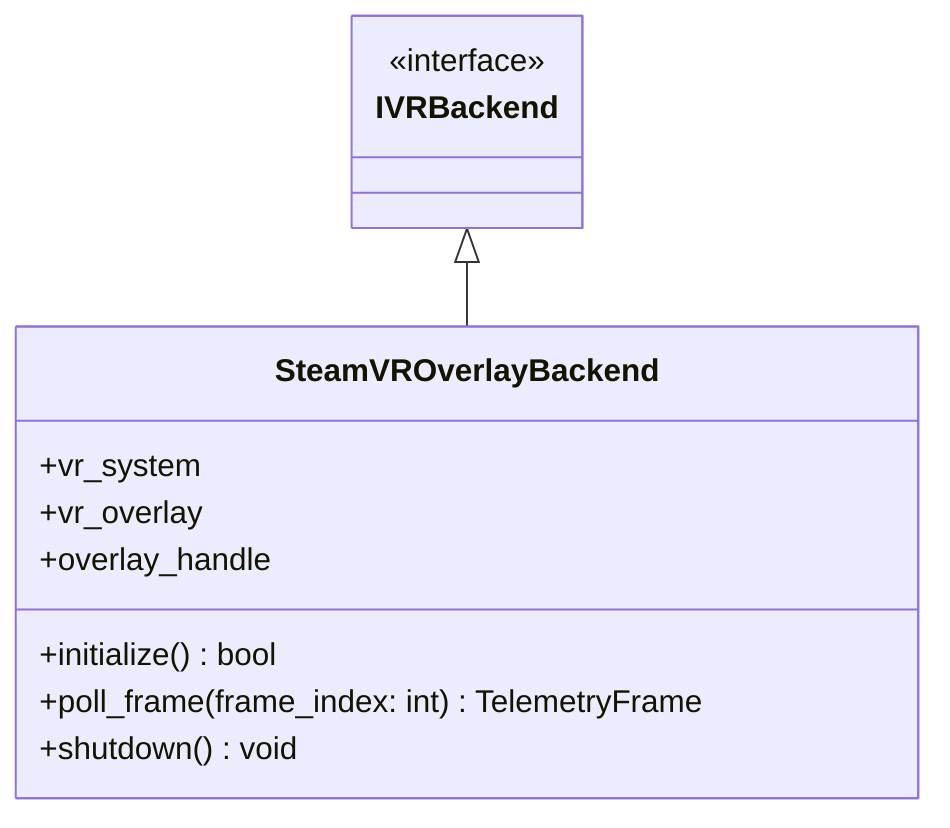

```mermaid
classDiagram
    class IVRBackend {
        <<interface>>
    }
    class SteamVROverlayBackend {
        +vr_system
        +vr_overlay
        +overlay_handle
        +initialize() bool
        +poll_frame(frame_index: int) TelemetryFrame
        +shutdown() void
    }
    IVRBackend <|-- SteamVROverlayBackend
```