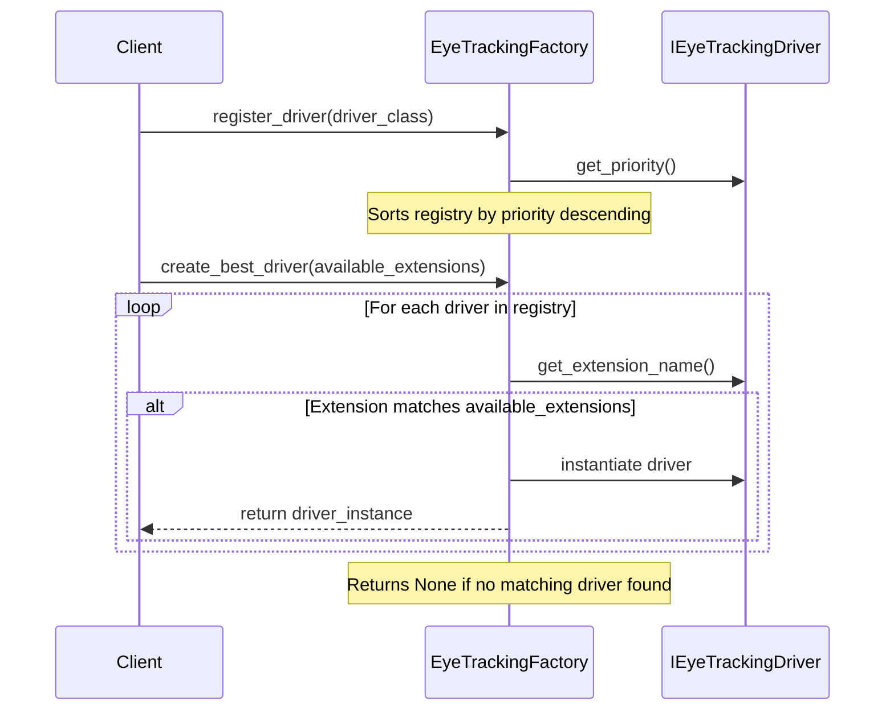

```mermaid
sequenceDiagram
    participant Client
    participant EyeTrackingFactory
    participant DriverClass as IEyeTrackingDriver

    Client->>EyeTrackingFactory: register_driver(driver_class)
    EyeTrackingFactory->>DriverClass: get_priority()
    Note over EyeTrackingFactory: Sorts registry by priority descending

    Client->>EyeTrackingFactory: create_best_driver(available_extensions)
    loop For each driver in registry
        EyeTrackingFactory->>DriverClass: get_extension_name()
        alt Extension matches available_extensions
            EyeTrackingFactory->>DriverClass: instantiate driver
            EyeTrackingFactory-->>Client: return driver_instance
        end
    end
    Note over EyeTrackingFactory: Returns None if no matching driver found
```