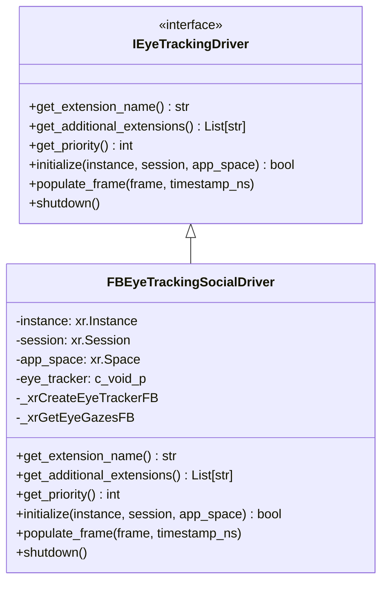

```mermaid
classDiagram
    class IEyeTrackingDriver {
        <<interface>>
        +get_extension_name() str
        +get_additional_extensions() List[str]
        +get_priority() int
        +initialize(instance, session, app_space) bool
        +populate_frame(frame, timestamp_ns)
        +shutdown()
    }

    class FBEyeTrackingSocialDriver {
        -instance: xr.Instance
        -session: xr.Session
        -app_space: xr.Space
        -eye_tracker: c_void_p
        -_xrCreateEyeTrackerFB
        -_xrGetEyeGazesFB
        +get_extension_name() str
        +get_additional_extensions() List[str]
        +get_priority() int
        +initialize(instance, session, app_space) bool
        +populate_frame(frame, timestamp_ns)
        +shutdown()
    }

    IEyeTrackingDriver <|-- FBEyeTrackingSocialDriver
```