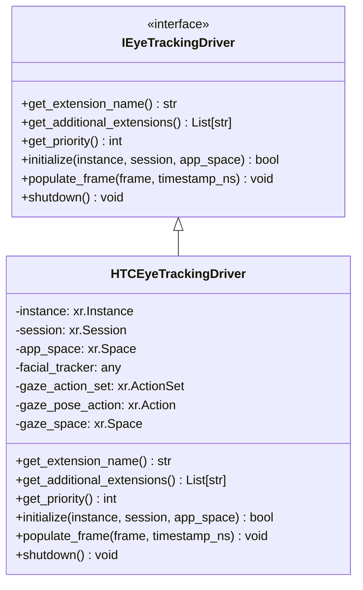

```mermaid
classDiagram
    class IEyeTrackingDriver {
        <<interface>>
        +get_extension_name() str
        +get_additional_extensions() List[str]
        +get_priority() int
        +initialize(instance, session, app_space) bool
        +populate_frame(frame, timestamp_ns) void
        +shutdown() void
    }
    class HTCEyeTrackingDriver {
        -instance: xr.Instance
        -session: xr.Session
        -app_space: xr.Space
        -facial_tracker: any
        -gaze_action_set: xr.ActionSet
        -gaze_pose_action: xr.Action
        -gaze_space: xr.Space
        +get_extension_name() str
        +get_additional_extensions() List[str]
        +get_priority() int
        +initialize(instance, session, app_space) bool
        +populate_frame(frame, timestamp_ns) void
        +shutdown() void
    }
    IEyeTrackingDriver <|-- HTCEyeTrackingDriver
```