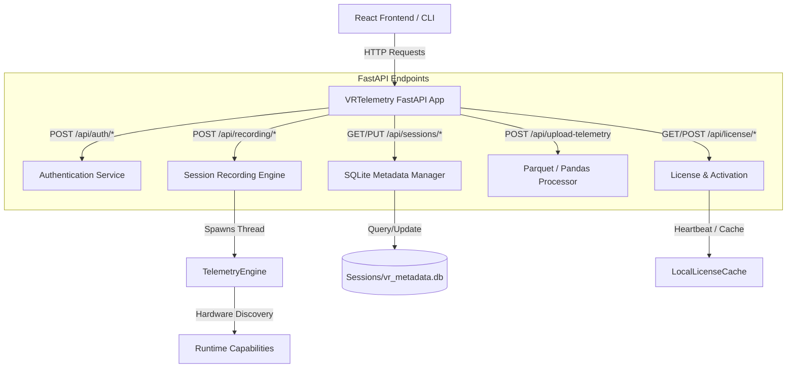

```mermaid
graph TD
    Client[React Frontend / CLI] -->|HTTP Requests| FastAPI[VRTelemetry FastAPI App]
    
    subgraph FastAPI Endpoints
        FastAPI -->|POST /api/auth/*| Auth[Authentication Service]
        FastAPI -->|POST /api/recording/*| Recording[Session Recording Engine]
        FastAPI -->|GET/PUT /api/sessions/*| Sessions[SQLite Metadata Manager]
        FastAPI -->|POST /api/upload-telemetry| Upload[Parquet / Pandas Processor]
        FastAPI -->|GET/POST /api/license/*| License[License & Activation]
    end

    Recording -->|Spawns Thread| Engine[TelemetryEngine]
    Engine -->|Hardware Discovery| Hardware[Runtime Capabilities]
    Sessions -->|Query/Update| DB[(Sessions/vr_metadata.db)]
    License -->|Heartbeat / Cache| Cache[LocalLicenseCache]
```