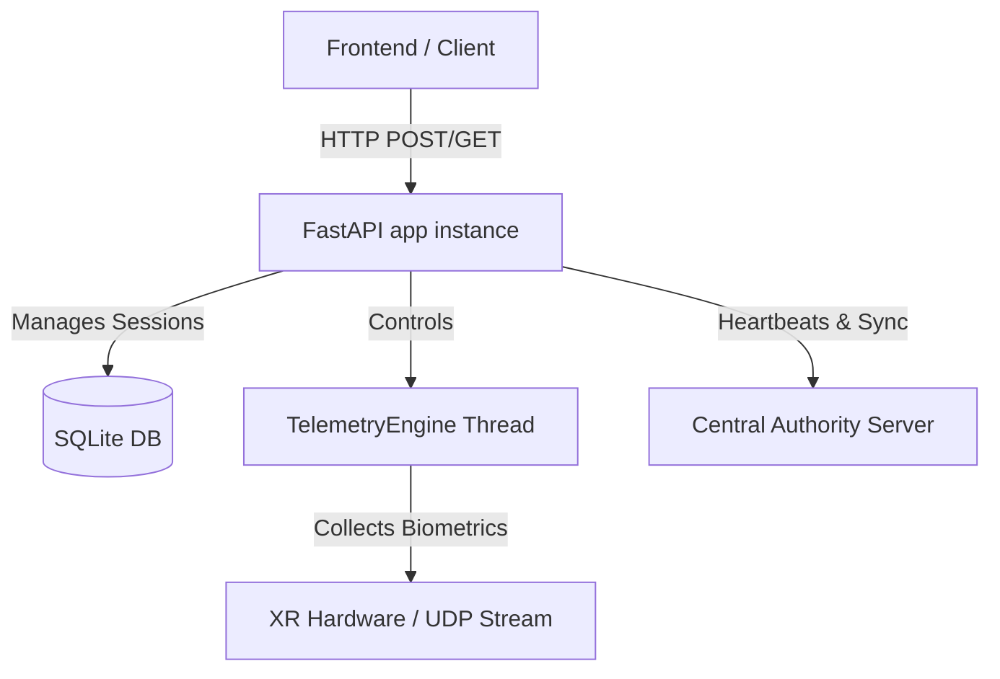

```mermaid
graph TD
    Client[Frontend / Client] -->|HTTP POST/GET| App[FastAPI app instance]
    App -->|Manages Sessions| SQLite[(SQLite DB)]
    App -->|Controls| Engine[TelemetryEngine Thread]
    Engine -->|Collects Biometrics| Hardware[XR Hardware / UDP Stream]
    App -->|Heartbeats & Sync| CentralServer[Central Authority Server]
```
