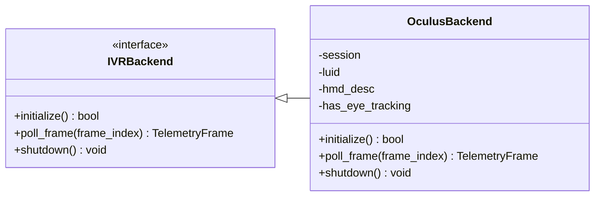

```mermaid
classDiagram
direction LR
class IVRBackend {
    <<interface>>
    +initialize() bool
    +poll_frame(frame_index) TelemetryFrame
    +shutdown() void
}
class OculusBackend {
    -session
    -luid
    -hmd_desc
    -has_eye_tracking
    +initialize() bool
    +poll_frame(frame_index) TelemetryFrame
    +shutdown() void
}
IVRBackend <|-- OculusBackend
```