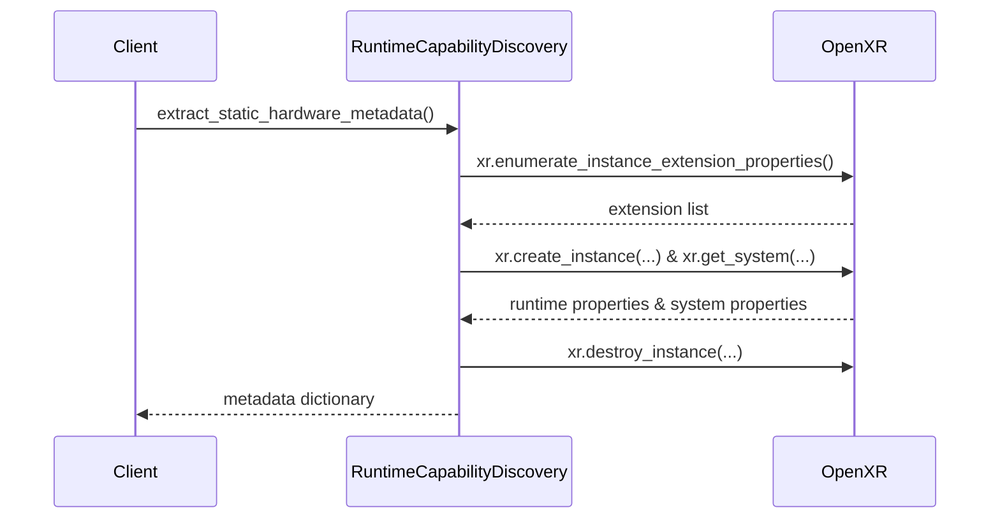

```mermaid
sequenceDiagram
    participant Client
    participant RuntimeCapabilityDiscovery
    participant OpenXR

    Client->>RuntimeCapabilityDiscovery: extract_static_hardware_metadata()
    RuntimeCapabilityDiscovery->>OpenXR: xr.enumerate_instance_extension_properties()
    OpenXR-->>RuntimeCapabilityDiscovery: extension list
    RuntimeCapabilityDiscovery->>OpenXR: xr.create_instance(...) & xr.get_system(...)
    OpenXR-->>RuntimeCapabilityDiscovery: runtime properties & system properties
    RuntimeCapabilityDiscovery->>OpenXR: xr.destroy_instance(...)
    RuntimeCapabilityDiscovery-->>Client: metadata dictionary
```