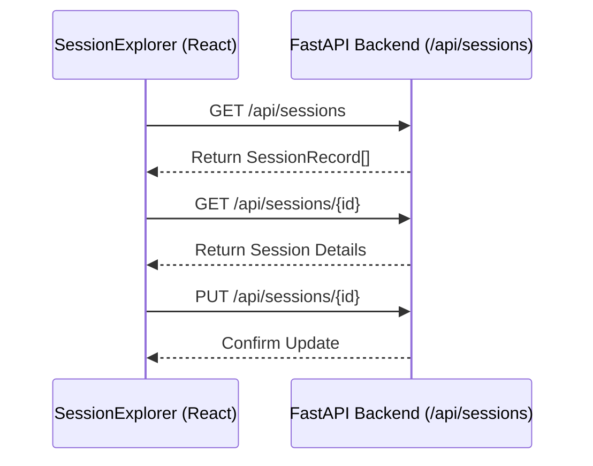

```mermaid
sequenceDiagram
    participant UI as SessionExplorer (React)
    participant API as FastAPI Backend (/api/sessions)
    UI->>API: GET /api/sessions
    API-->>UI: Return SessionRecord[]
    UI->>API: GET /api/sessions/{id}
    API-->>UI: Return Session Details
    UI->>API: PUT /api/sessions/{id}
    API-->>UI: Confirm Update
```
