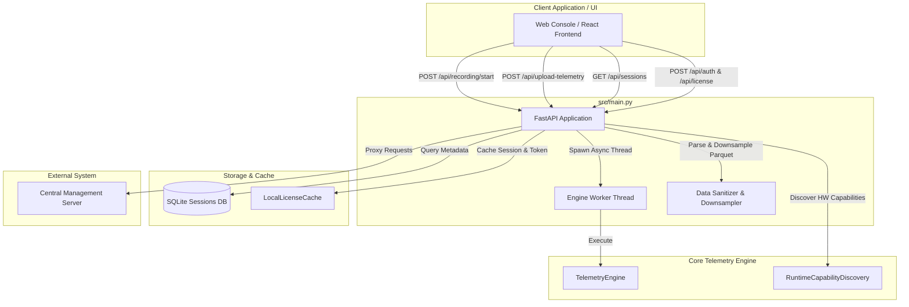

```mermaid
graph TD
    subgraph Client Application / UI
        UI[Web Console / React Frontend]
    end

    subgraph Main Application Module [src/main.py]
        API[FastAPI Application]
        WorkerThread[Engine Worker Thread]
        Sanitizer[Data Sanitizer & Downsampler]
    end

    subgraph Core Telemetry Engine
        TE[TelemetryEngine]
        Discovery[RuntimeCapabilityDiscovery]
    end

    subgraph Storage & Cache
        SQLite[(SQLite Sessions DB)]
        Cache[LocalLicenseCache]
    end

    subgraph External System
        Central[Central Management Server]
    end

    UI -->|POST /api/recording/start| API
    API -->|Discover HW Capabilities| Discovery
    API -->|Spawn Async Thread| WorkerThread
    WorkerThread -->|Execute| TE
    
    UI -->|POST /api/upload-telemetry| API
    API -->|Parse & Downsample Parquet| Sanitizer
    
    UI -->|GET /api/sessions| API
    API -->|Query Metadata| SQLite
    
    UI -->|POST /api/auth & /api/license| API
    API -->|Proxy Requests| Central
    API -->|Cache Session & Token| Cache
```