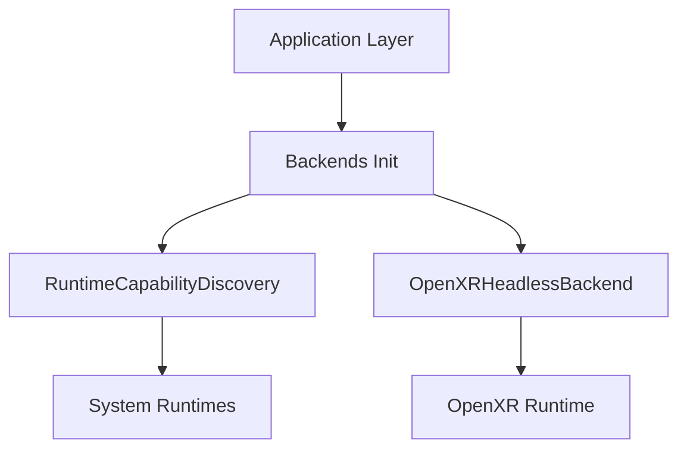

```mermaid
graph TD
    A[Application Layer] --> B[Backends Init]
    B --> C[RuntimeCapabilityDiscovery]
    B --> D[OpenXRHeadlessBackend]
    C --> E[System Runtimes]
    D --> F[OpenXR Runtime]
```
