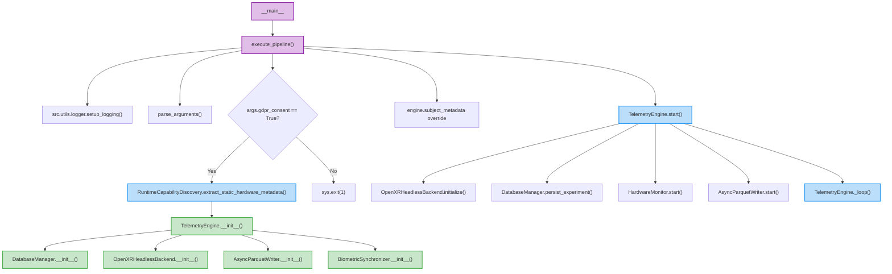

```mermaid
flowchart TD
    Main["__main__"] --> Exec["execute_pipeline()"]
    Exec --> SetupLog["src.utils.logger.setup_logging()"]
    Exec --> ParseArgs["parse_arguments()"]
    Exec --> HardwareCheck{"args.gdpr_consent == True?"}
    HardwareCheck -- Yes --> ExtHW["RuntimeCapabilityDiscovery.extract_static_hardware_metadata()"]
    HardwareCheck -- No --> Exit1["sys.exit(1)"]
    ExtHW --> EngineInit["TelemetryEngine.__init__()"]
    EngineInit --> DBInit["DatabaseManager.__init__()"]
    EngineInit --> XRInit["OpenXRHeadlessBackend.__init__()"]
    EngineInit --> PQInit["AsyncParquetWriter.__init__()"]
    EngineInit --> SyncInit["BiometricSynchronizer.__init__()"]
    Exec --> EnforceID["engine.subject_metadata override"]
    Exec --> EngineStart["TelemetryEngine.start()"]
    EngineStart --> XRInitSys["OpenXRHeadlessBackend.initialize()"]
    EngineStart --> DBPersist["DatabaseManager.persist_experiment()"]
    EngineStart --> HWStart["HardwareMonitor.start()"]
    EngineStart --> PQStart["AsyncParquetWriter.start()"]
    EngineStart --> Loop["TelemetryEngine._loop()"]
    classDef entry fill:#e1bee7,stroke:#8e24aa,stroke-width:2px;
    classDef logic fill:#bbdefb,stroke:#2196f3,stroke-width:2px;
    classDef init fill:#c8e6c9,stroke:#4caf50,stroke-width:2px;
    class Main,Exec entry;
    class EngineStart,Loop,ExtHW logic;
    class EngineInit,DBInit,XRInit,PQInit,SyncInit init;
```

