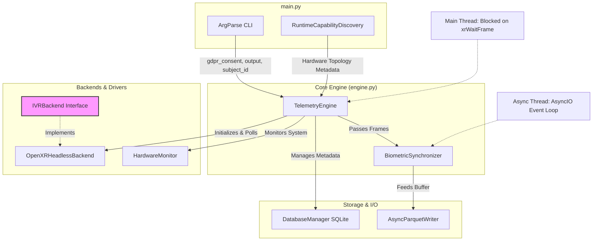

```mermaid
flowchart TB
    subgraph Bootstrapper ["main.py"]
        CLI["ArgParse CLI"]
        Discovery["RuntimeCapabilityDiscovery"]
    end
    subgraph Core ["Core Engine (engine.py)"]
        TE["TelemetryEngine"]
        Sync["BiometricSynchronizer"]
    end
    subgraph Hardware_Abstractions ["Backends & Drivers"]
        IVR["IVRBackend Interface"]
        OpenXR["OpenXRHeadlessBackend"]
        HW_Mon["HardwareMonitor"]
    end
    subgraph Storage ["Storage & I/O"]
        DB["DatabaseManager SQLite"]
        PQ["AsyncParquetWriter"]
    end
    CLI -->|"gdpr_consent, output, subject_id"| TE
    Discovery -->|"Hardware Topology Metadata"| TE
    TE -->|"Manages Metadata"| DB
    TE -->|"Monitors System"| HW_Mon
    TE -->|"Initializes & Polls"| OpenXR
    TE -->|"Passes Frames"| Sync
    IVR -.->|"Implements"| OpenXR
    Sync -->|"Feeds Buffer"| PQ
    note_main_thread["Main Thread: Blocked on xrWaitFrame"] -.-> TE
    note_async_thread["Async Thread: AsyncIO Event Loop"] -.-> Sync
    classDef interface fill:#f9f,stroke:#333,stroke-width:2px;
    class IVR interface;
```

