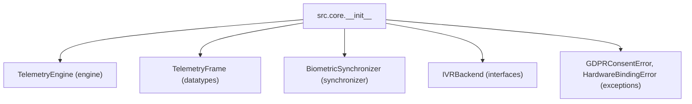

```mermaid
graph TD
    CoreInit["src.core.__init__"]
    CoreInit --> TelemetryEngine["TelemetryEngine (engine)"]
    CoreInit --> TelemetryFrame["TelemetryFrame (datatypes)"]
    CoreInit --> BiometricSynchronizer["BiometricSynchronizer (synchronizer)"]
    CoreInit --> IVRBackend["IVRBackend (interfaces)"]
    CoreInit --> Exceptions["GDPRConsentError, HardwareBindingError (exceptions)"]
```
