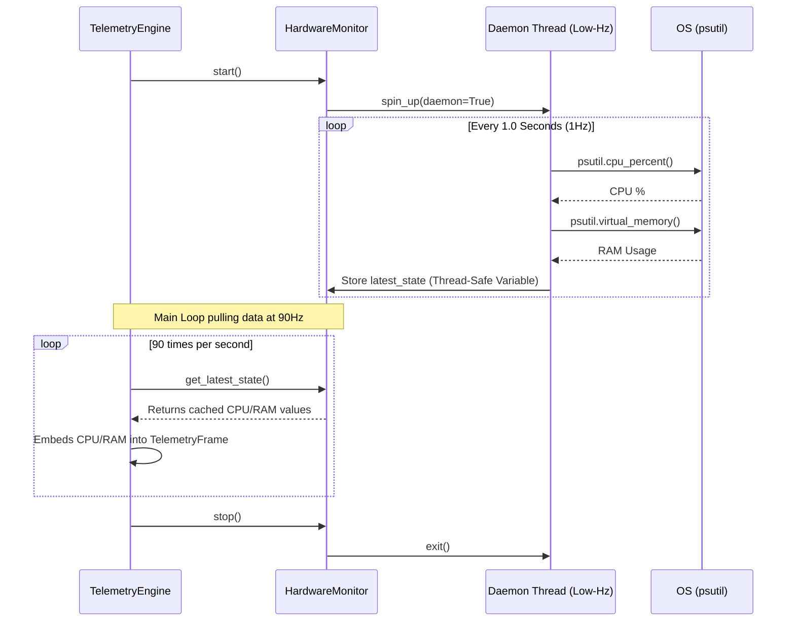

```mermaid
sequenceDiagram
    participant Engine as TelemetryEngine
    participant HWMon as HardwareMonitor
    participant HWThread as Daemon Thread (Low-Hz)
    participant OS as OS (psutil)
    
    Engine->>HWMon: start()
    HWMon->>HWThread: spin_up(daemon=True)
    
    loop Every 1.0 Seconds (1Hz)
        HWThread->>OS: psutil.cpu_percent()
        OS-->>HWThread: CPU %
        HWThread->>OS: psutil.virtual_memory()
        OS-->>HWThread: RAM Usage
        
        HWThread->>HWMon: Store latest_state (Thread-Safe Variable)
    end
    
    note over Engine, HWMon: Main Loop pulling data at 90Hz
    loop 90 times per second
        Engine->>HWMon: get_latest_state()
        HWMon-->>Engine: Returns cached CPU/RAM values
        Engine->>Engine: Embeds CPU/RAM into TelemetryFrame
    end
    
    Engine->>HWMon: stop()
    HWMon->>HWThread: exit()
```
