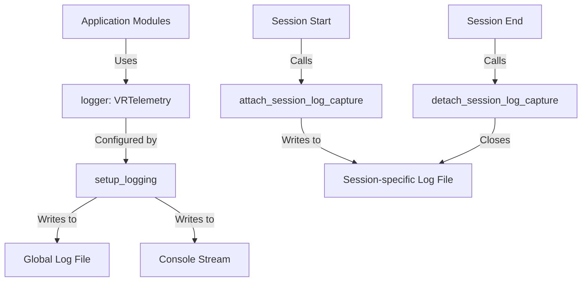

```mermaid
graph TD
    A[Application Modules] -->|Uses| B[logger: VRTelemetry]
    B -->|Configured by| C[setup_logging]
    C -->|Writes to| D[Global Log File]
    C -->|Writes to| E[Console Stream]
    F[Session Start] -->|Calls| G[attach_session_log_capture]
    G -->|Writes to| H[Session-specific Log File]
    I[Session End] -->|Calls| J[detach_session_log_capture]
    J -->|Closes| H
```
