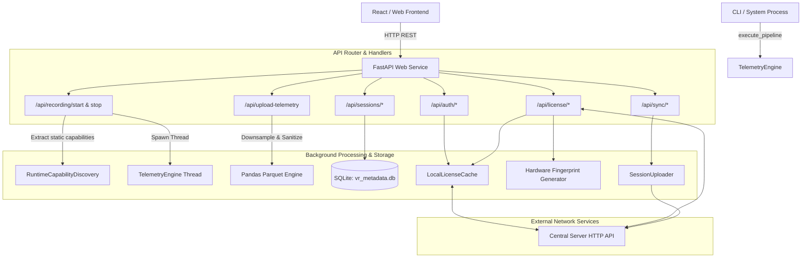

```mermaid
graph TD
    User[CLI / System Process] -->|execute_pipeline| EngineCLI[TelemetryEngine]
    WebClient[React / Web Frontend] -->|HTTP REST| API[FastAPI Web Service]

    subgraph API Router & Handlers
        API --> RecEP["/api/recording/start & stop"]
        API --> UploadEP["/api/upload-telemetry"]
        API --> SessEP["/api/sessions/*"]
        API --> AuthEP["/api/auth/*"]
        API --> LicEP["/api/license/*"]
        API --> SyncEP["/api/sync/*"]
    end

    subgraph Background Processing & Storage
        RecEP -->|Extract static capabilities| RCD[RuntimeCapabilityDiscovery]
        RecEP -->|Spawn Thread| EngineThread[TelemetryEngine Thread]
        UploadEP -->|Downsample & Sanitize| Pandas[Pandas Parquet Engine]
        SessEP --> SQLite[(SQLite: vr_metadata.db)]
        AuthEP --> LocalCache[LocalLicenseCache]
        LicEP --> Fingerprint[Hardware Fingerprint Generator]
        LicEP --> LocalCache
        SyncEP --> Uploader[SessionUploader]
    end

    subgraph External Network Services
        LocalCache <--> CentralServer[Central Server HTTP API]
        LicEP <--> CentralServer
        Uploader --> CentralServer
    end
```