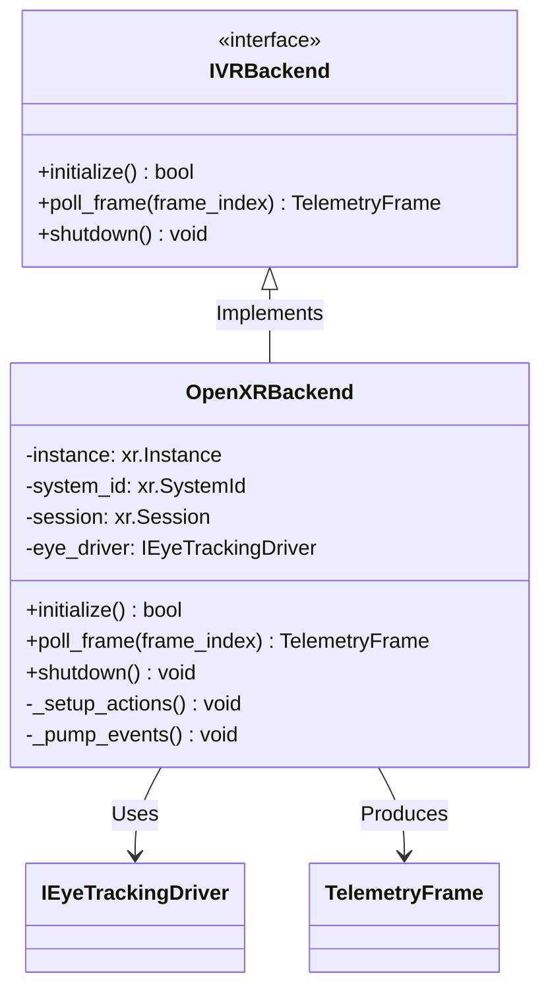

```mermaid
classDiagram
    class IVRBackend {
        <<interface>>
        +initialize() bool
        +poll_frame(frame_index) TelemetryFrame
        +shutdown() void
    }
    class OpenXRBackend {
        -instance: xr.Instance
        -system_id: xr.SystemId
        -session: xr.Session
        -eye_driver: IEyeTrackingDriver
        +initialize() bool
        +poll_frame(frame_index) TelemetryFrame
        +shutdown() void
        -_setup_actions() void
        -_pump_events() void
    }
    IVRBackend <|-- OpenXRBackend : Implements
    OpenXRBackend --> IEyeTrackingDriver : Uses
    OpenXRBackend --> TelemetryFrame : Produces
```