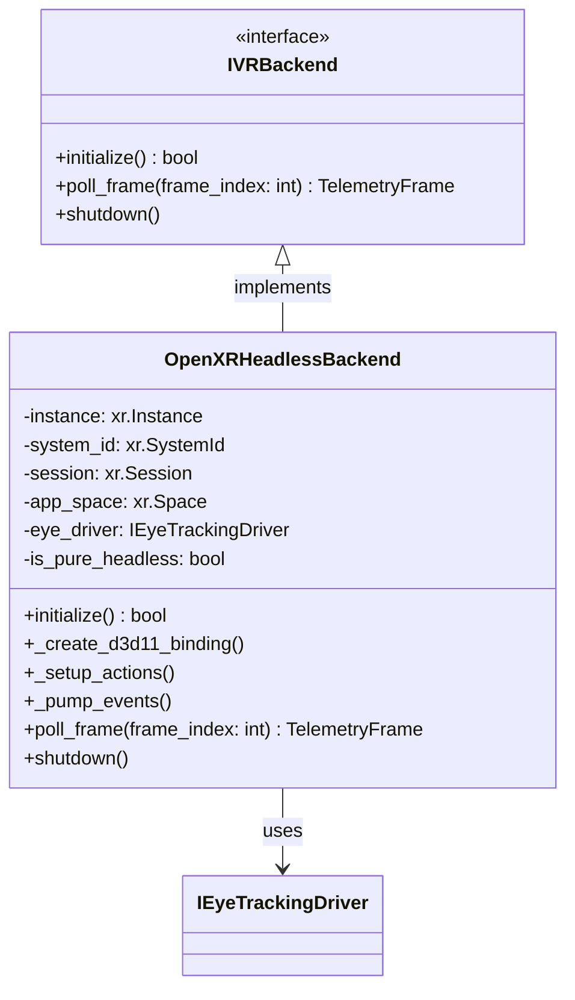

```mermaid
classDiagram
    class IVRBackend {
        <<interface>>
        +initialize() bool
        +poll_frame(frame_index: int) TelemetryFrame
        +shutdown()
    }
    class OpenXRHeadlessBackend {
        -instance: xr.Instance
        -system_id: xr.SystemId
        -session: xr.Session
        -app_space: xr.Space
        -eye_driver: IEyeTrackingDriver
        -is_pure_headless: bool
        +initialize() bool
        +_create_d3d11_binding()
        +_setup_actions()
        +_pump_events()
        +poll_frame(frame_index: int) TelemetryFrame
        +shutdown()
    }
    IVRBackend <|-- OpenXRHeadlessBackend : implements
    OpenXRHeadlessBackend --> IEyeTrackingDriver : uses
```