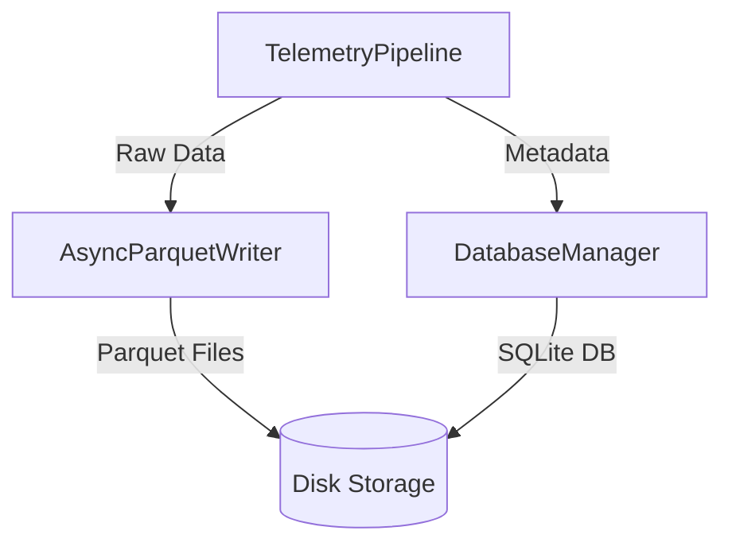

```mermaid
graph TD
    TelemetryPipeline -->|Raw Data| AsyncParquetWriter
    TelemetryPipeline -->|Metadata| DatabaseManager
    AsyncParquetWriter -->|Parquet Files| Disk[(Disk Storage)]
    DatabaseManager -->|SQLite DB| Disk
```
