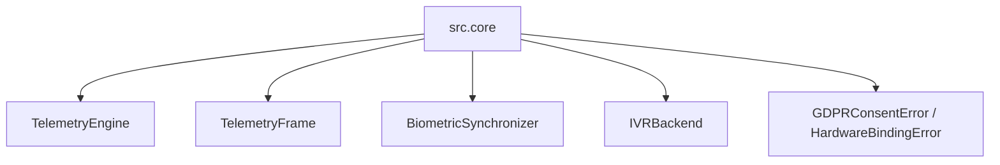

```mermaid
graph TD
    CorePkg[src.core] --> Engine[TelemetryEngine]
    CorePkg --> Models[TelemetryFrame]
    CorePkg --> Sync[BiometricSynchronizer]
    CorePkg --> Interfaces[IVRBackend]
    CorePkg --> Exceptions[GDPRConsentError / HardwareBindingError]
```