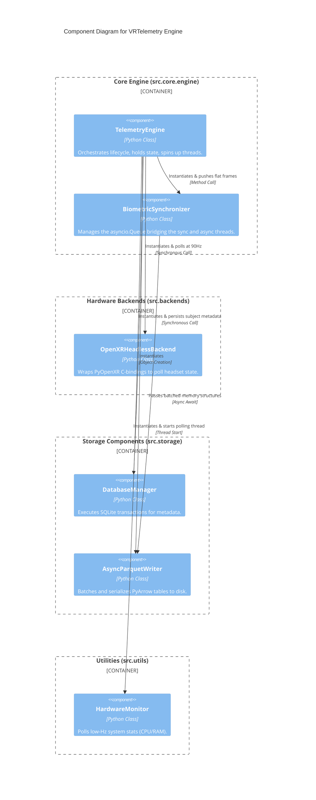

```mermaid
C4Component
    title Component Diagram for VRTelemetry Engine

    Container_Boundary(core_engine, "Core Engine (src.core.engine)") {
        Component(engine_cls, "TelemetryEngine", "Python Class", "Orchestrates lifecycle, holds state, spins up threads.")
        Component(sync_cls, "BiometricSynchronizer", "Python Class", "Manages the asyncio.Queue bridging the sync and async threads.")
    }

    Container_Boundary(backends, "Hardware Backends (src.backends)") {
        Component(openxr_be, "OpenXRHeadlessBackend", "Python Class", "Wraps PyOpenXR C-bindings to poll headset state.")
    }

    Container_Boundary(storage, "Storage Components (src.storage)") {
        Component(db_mgr, "DatabaseManager", "Python Class", "Executes SQLite transactions for metadata.")
        Component(pq_writer, "AsyncParquetWriter", "Python Class", "Batches and serializes PyArrow tables to disk.")
    }

    Container_Boundary(utils, "Utilities (src.utils)") {
        Component(hw_mon, "HardwareMonitor", "Python Class", "Polls low-Hz system stats (CPU/RAM).")
    }

    Rel(engine_cls, openxr_be, "Instantiates & polls at 90Hz", "Synchronous Call")
    Rel(engine_cls, sync_cls, "Instantiates & pushes flat frames", "Method Call")
    Rel(engine_cls, db_mgr, "Instantiates & persists subject metadata", "Synchronous Call")
    Rel(engine_cls, hw_mon, "Instantiates & starts polling thread", "Thread Start")
    Rel(engine_cls, pq_writer, "Instantiates", "Object Creation")
    
    Rel(sync_cls, pq_writer, "Passes batched memory structures", "Async Await")
    
    UpdateLayoutConfig($c4ShapeInRow="2", $c4BoundaryInRow="1")
```
