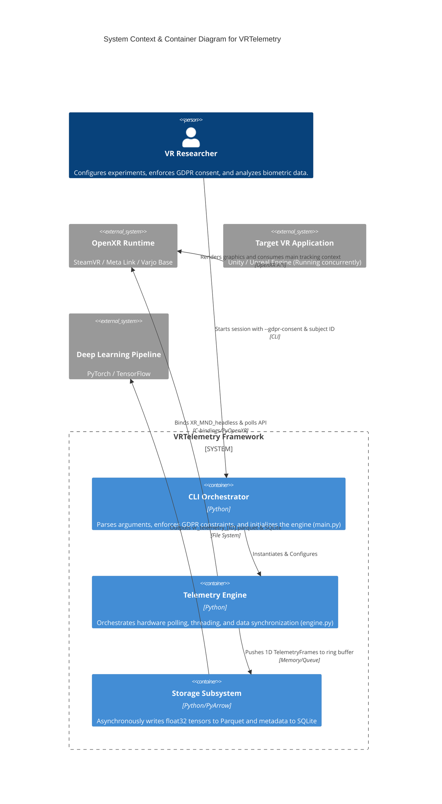

```mermaid
C4Context
    title System Context & Container Diagram for VRTelemetry

    Person(researcher, "VR Researcher", "Configures experiments, enforces GDPR consent, and analyzes biometric data.")
    
    System_Boundary(vr_telemetry_sys, "VRTelemetry Framework") {
        Container(cli_bootstrapper, "CLI Orchestrator", "Python", "Parses arguments, enforces GDPR constraints, and initializes the engine (main.py)")
        Container(telemetry_engine, "Telemetry Engine", "Python", "Orchestrates hardware polling, threading, and data synchronization (engine.py)")
        Container(storage_manager, "Storage Subsystem", "Python/PyArrow", "Asynchronously writes float32 tensors to Parquet and metadata to SQLite")
    }

    System_Ext(openxr_runtime, "OpenXR Runtime", "SteamVR / Meta Link / Varjo Base")
    System_Ext(target_vr_app, "Target VR Application", "Unity / Unreal Engine (Running concurrently)")
    System_Ext(dl_pipeline, "Deep Learning Pipeline", "PyTorch / TensorFlow", "Consumes Parquet datasets for cognitive load or cyber-sickness prediction")

    Rel(researcher, cli_bootstrapper, "Starts session with --gdpr-consent & subject ID", "CLI")
    Rel(cli_bootstrapper, telemetry_engine, "Instantiates & Configures")
    Rel(telemetry_engine, openxr_runtime, "Binds XR_MND_headless & polls API", "C-bindings/PyOpenXR")
    Rel(target_vr_app, openxr_runtime, "Renders graphics and consumes main tracking context", "OpenXR API")
    Rel(telemetry_engine, storage_manager, "Pushes 1D TelemetryFrames to ring buffer", "Memory/Queue")
    Rel(storage_manager, dl_pipeline, "Outputs vr_telemetry_[ID].parquet & SQLite", "File System")
    
    UpdateLayoutConfig($c4ShapeInRow="3", $c4BoundaryInRow="1")
```
