# Central Data Ingest Flow Central Data Manager Ingest Flow Central Data Schema Flow Central Server Data Schema Data Manager Ingest Flow Data Quality Computation Data Quality Dataflo Combined

# Central Data Ingest Flow

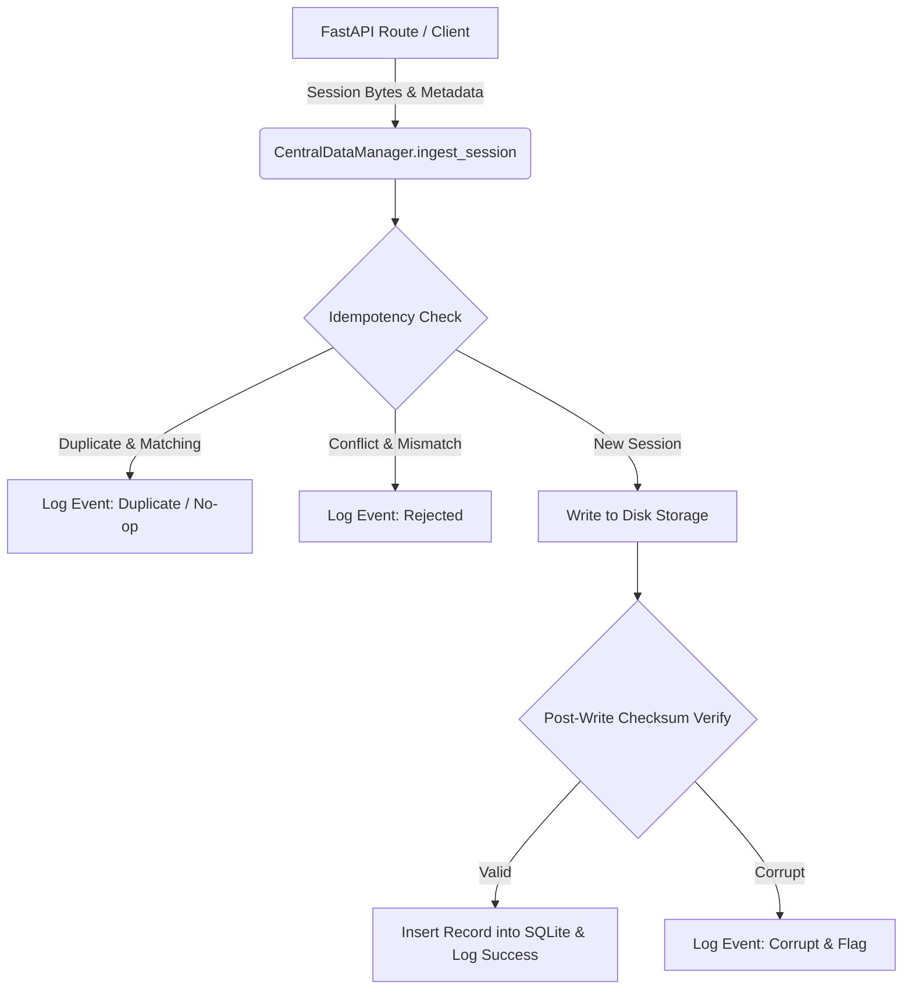
```mermaid
flowchart TD
    A[FastAPI Route / Client] -->|Session Bytes & Metadata| B(CentralDataManager.ingest_session)
    B --> C{Idempotency Check}
    C -->|Duplicate & Matching| D[Log Event: Duplicate / No-op]
    C -->|Conflict & Mismatch| E[Log Event: Rejected]
    C -->|New Session| F[Write to Disk Storage]
    F --> G{Post-Write Checksum Verify}
    G -->|Valid| H[Insert Record into SQLite & Log Success]
    G -->|Corrupt| I[Log Event: Corrupt & Flag]
```

---

# Central Data Manager Ingest Flow

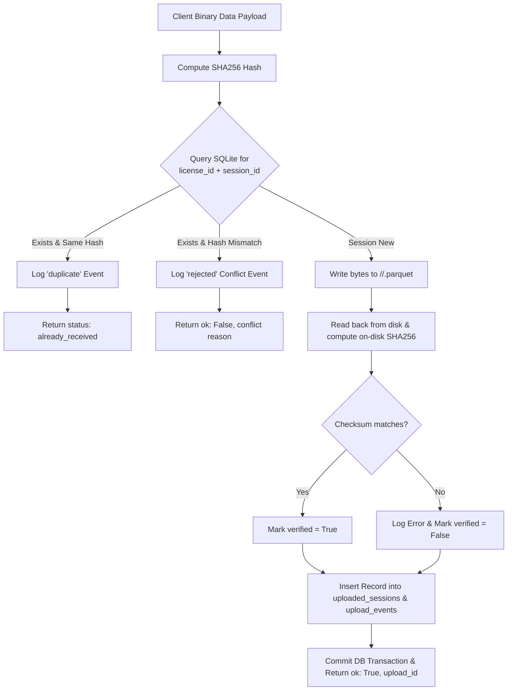
```mermaid
flowchart TD
    A[Client Binary Data Payload] --> B[Compute SHA256 Hash]
    B --> C{Query SQLite for
license_id + session_id}
    
    C -- Exists & Same Hash --> D[Log 'duplicate' Event]
    D --> E[Return status: already_received]
    
    C -- Exists & Hash Mismatch --> F[Log 'rejected' Conflict Event]
    F --> G[Return ok: False, conflict reason]
    
    C -- Session New --> H[Write bytes to <storage_root>/<license_id>/<session_id>.parquet]
    H --> I[Read back from disk & compute on-disk SHA256]
    I --> J{Checksum matches?}
    
    J -- Yes --> K[Mark verified = True]
    J -- No --> L[Log Error & Mark verified = False]
    
    K --> M[Insert Record into uploaded_sessions & upload_events]
    L --> M
    M --> N[Commit DB Transaction & Return ok: True, upload_id]
```

---

# Central Data Schema Flow

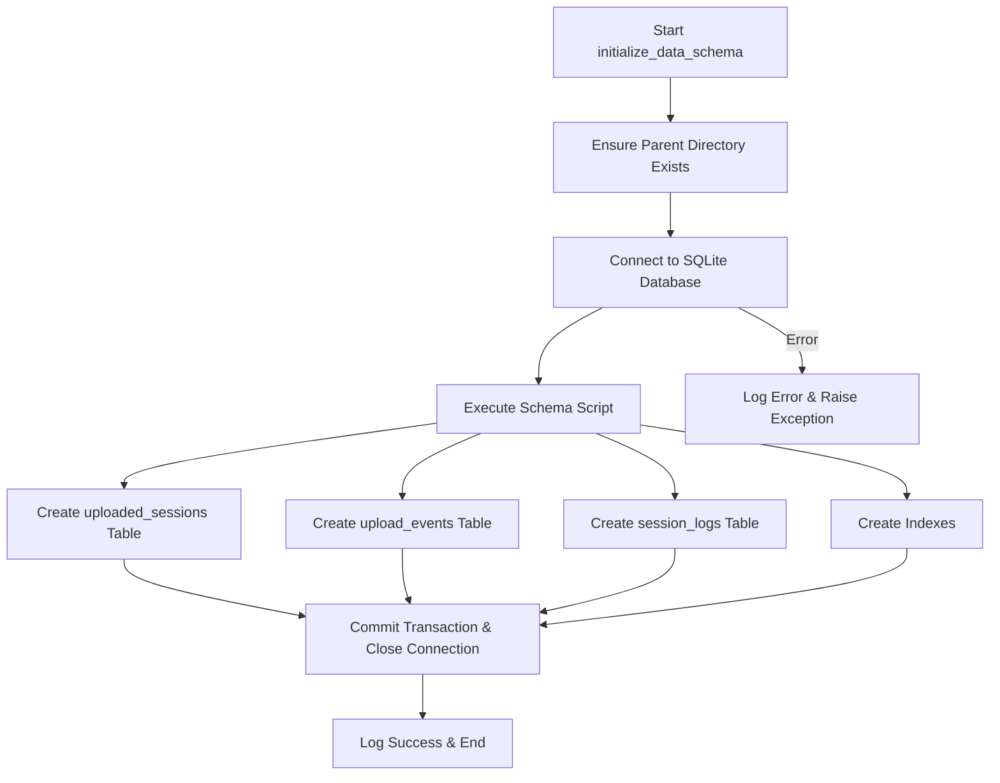
```mermaid
flowchart TD
    A[Start initialize_data_schema] --> B[Ensure Parent Directory Exists]
    B --> C[Connect to SQLite Database]
    C --> D[Execute Schema Script]
    D --> E[Create uploaded_sessions Table]
    D --> F[Create upload_events Table]
    D --> G[Create session_logs Table]
    D --> H[Create Indexes]
    E & F & G & H --> I[Commit Transaction & Close Connection]
    I --> J[Log Success & End]
    C -- Error --> K[Log Error & Raise Exception]
```

---

# Central Server Data Schema

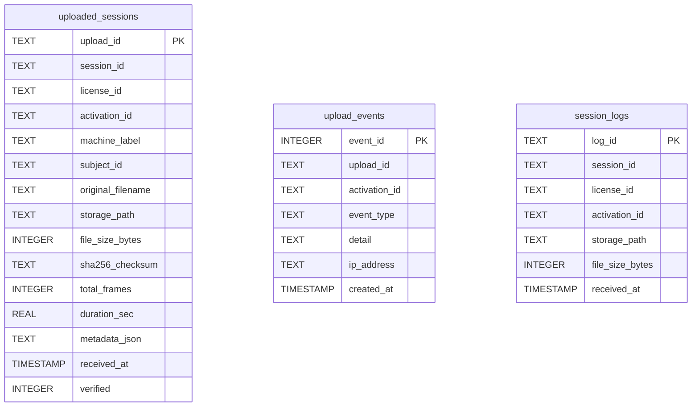
```mermaid
erDiagram
    uploaded_sessions {
        TEXT upload_id PK
        TEXT session_id
        TEXT license_id
        TEXT activation_id
        TEXT machine_label
        TEXT subject_id
        TEXT original_filename
        TEXT storage_path
        INTEGER file_size_bytes
        TEXT sha256_checksum
        INTEGER total_frames
        REAL duration_sec
        TEXT metadata_json
        TIMESTAMP received_at
        INTEGER verified
    }

    upload_events {
        INTEGER event_id PK
        TEXT upload_id
        TEXT activation_id
        TEXT event_type
        TEXT detail
        TEXT ip_address
        TIMESTAMP created_at
    }

    session_logs {
        TEXT log_id PK
        TEXT session_id
        TEXT license_id
        TEXT activation_id
        TEXT storage_path
        INTEGER file_size_bytes
        TIMESTAMP received_at
    }
```

---

# Data Manager Ingest Flow

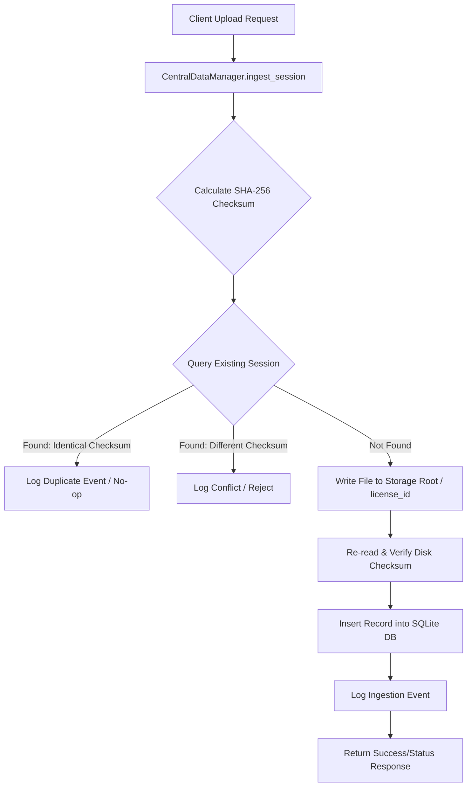
```mermaid
graph TD
    A[Client Upload Request] --> B[CentralDataManager.ingest_session]
    B --> C{Calculate SHA-256 Checksum}
    C --> D{Query Existing Session}
    D -->|Found: Identical Checksum| E[Log Duplicate Event / No-op]
    D -->|Found: Different Checksum| F[Log Conflict / Reject]
    D -->|Not Found| G[Write File to Storage Root / license_id]
    G --> H[Re-read & Verify Disk Checksum]
    H --> I[Insert Record into SQLite DB]
    I --> J[Log Ingestion Event]
    J --> K[Return Success/Status Response]
```

---

# Data Quality Computation

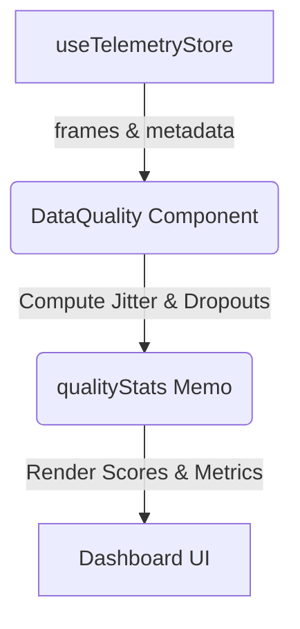
```mermaid
graph TD
    A[useTelemetryStore] -->|frames & metadata| B(DataQuality Component)
    B -->|Compute Jitter & Dropouts| C(qualityStats Memo)
    C -->|Render Scores & Metrics| D[Dashboard UI]
```

---

# Data Quality Dataflow

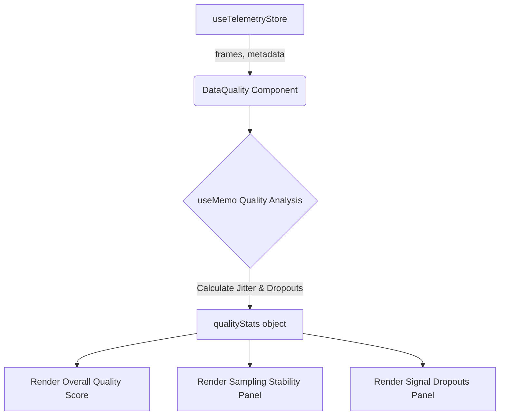
```mermaid
graph TD
    A[useTelemetryStore] -->|frames, metadata| B(DataQuality Component)
    B --> C{useMemo Quality Analysis}
    C -->|Calculate Jitter & Dropouts| D[qualityStats object]
    D --> E[Render Overall Quality Score]
    D --> F[Render Sampling Stability Panel]
    D --> G[Render Signal Dropouts Panel]
```

---

# Data Schema Erd


```mermaid
erDiagram
    uploaded_sessions {
        TEXT upload_id PK
        TEXT session_id
        TEXT license_id
        TEXT activation_id
        TEXT machine_label
        TEXT subject_id
        TEXT original_filename
        TEXT storage_path
        INTEGER file_size_bytes
        TEXT sha256_checksum
        INTEGER total_frames
        REAL duration_sec
        TEXT metadata_json
        TIMESTAMP received_at
        INTEGER verified
    }
    upload_events {
        INTEGER event_id PK
        TEXT upload_id
        TEXT activation_id
        TEXT event_type
        TEXT detail
        TEXT ip_address
        TIMESTAMP created_at
    }
    session_logs {
        TEXT log_id PK
        TEXT session_id
        TEXT license_id
        TEXT activation_id
        TEXT storage_path
        INTEGER file_size_bytes
        TIMESTAMP received_at
    }
```

---

# Database Manager Dataflow

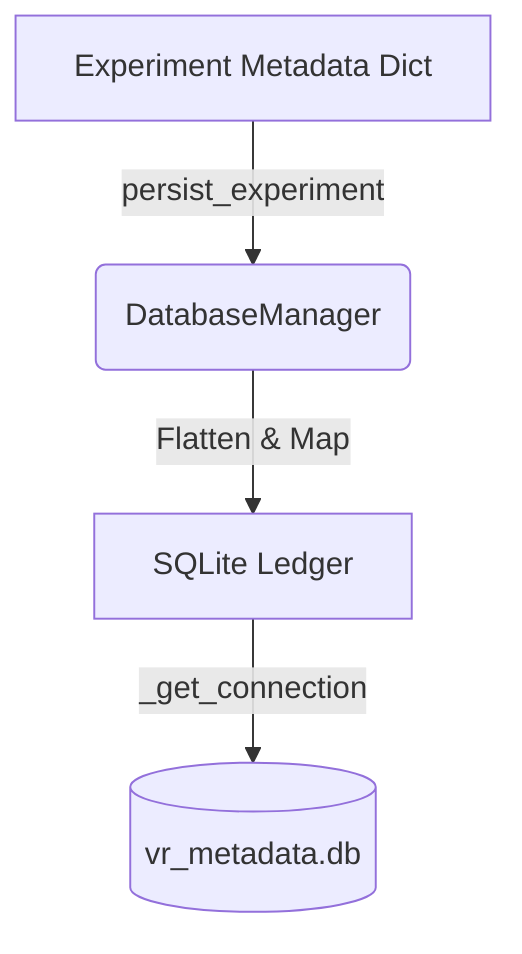
```mermaid
flowchart TD
    A[Experiment Metadata Dict] -->|persist_experiment| B(DatabaseManager)
    B -->|Flatten & Map| C[SQLite Ledger]
    C -->|_get_connection| D[(vr_metadata.db)]
```

---

# Db Schema Architecture

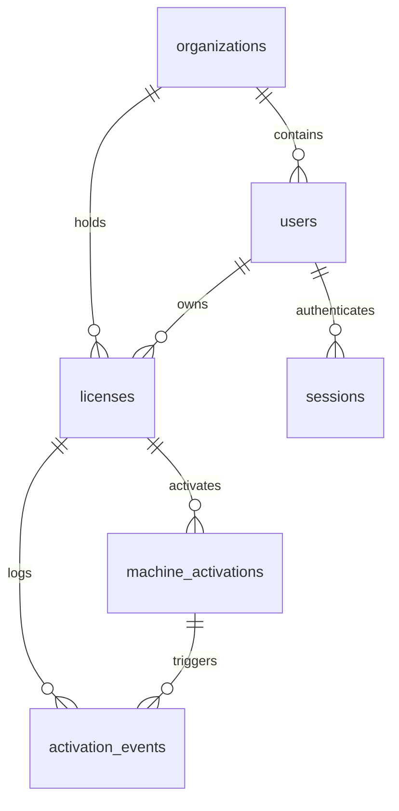
```mermaid
erDiagram
    organizations ||--o{ users : contains
    organizations ||--o{ licenses : holds
    users ||--o{ sessions : authenticates
    users ||--o{ licenses : owns
    licenses ||--o{ machine_activations : activates
    licenses ||--o{ activation_events : logs
    machine_activations ||--o{ activation_events : triggers
```

---

# Erd Metadata Schema

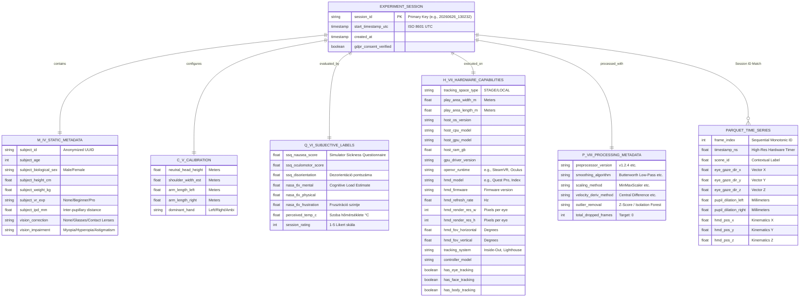
```mermaid
erDiagram
    %% SQLite Relational Data
    EXPERIMENT_SESSION ||--|| M_IV_STATIC_METADATA : contains
    EXPERIMENT_SESSION ||--|| C_V_CALIBRATION : configures
    EXPERIMENT_SESSION ||--|| Q_VI_SUBJECTIVE_LABELS : evaluated_by
    EXPERIMENT_SESSION ||--|| H_VII_HARDWARE_CAPABILITIES : executed_on
    EXPERIMENT_SESSION ||--|| P_VIII_PROCESSING_METADATA : processed_with
    
    %% Implicit relation to Parquet
    EXPERIMENT_SESSION ||--o{ PARQUET_TIME_SERIES : "Session ID Match"

    EXPERIMENT_SESSION {
        string session_id PK "Primary Key (e.g., 20260626_130232)"
        timestamp start_timestamp_utc "ISO 8601 UTC"
        timestamp created_at
        boolean gdpr_consent_verified
    }

    M_IV_STATIC_METADATA {
        string subject_id "Anonymized UUID"
        int subject_age
        string subject_biological_sex "Male/Female"
        float subject_height_cm
        float subject_weight_kg
        string subject_vr_exp "None/Beginner/Pro"
        float subject_ipd_mm "Inter-pupillary distance"
        string vision_correction "None/Glasses/Contact Lenses"
        string vision_impairment "Myopia/Hyperopia/Astigmatism"
    }

    C_V_CALIBRATION {
        float neutral_head_height "Meters"
        float shoulder_width_est "Meters"
        float arm_length_left "Meters"
        float arm_length_right "Meters"
        string dominant_hand "Left/Right/Ambi"
    }

    Q_VI_SUBJECTIVE_LABELS {
        float ssq_nausea_score "Simulator Sickness Questionnaire"
        float ssq_oculomotor_score
        float ssq_disorientation "Dezorientáció pontszáma"
        float nasa_tlx_mental "Cognitive Load Estimate"
        float nasa_tlx_physical
        float nasa_tlx_frustration "Frusztráció szintje"
        float perceived_temp_c "Szoba hőmérséklete °C"
        int session_rating "1-5 Likert skála"
    }

    H_VII_HARDWARE_CAPABILITIES {
        string tracking_space_type "STAGE/LOCAL"
        float play_area_width_m "Meters"
        float play_area_length_m "Meters"
        string host_os_version
        string host_cpu_model
        string host_gpu_model
        float host_ram_gb
        string gpu_driver_version
        string openxr_runtime "e.g., SteamVR, Oculus"
        string hmd_model "e.g., Quest Pro, Index"
        string hmd_firmware "Firmware version"
        float hmd_refresh_rate "Hz"
        int hmd_render_res_w "Pixels per eye"
        int hmd_render_res_h "Pixels per eye"
        float hmd_fov_horizontal "Degrees"
        float hmd_fov_vertical "Degrees"
        string tracking_system "Inside-Out, Lighthouse"
        string controller_model
        boolean has_eye_tracking
        boolean has_face_tracking
        boolean has_body_tracking
    }
    
    P_VIII_PROCESSING_METADATA {
        string preprocessor_version "v1.2.4 etc."
        string smoothing_algorithm "Butterworth Low-Pass etc."
        string scaling_method "MinMaxScaler etc."
        string velocity_deriv_method "Central Difference etc."
        string outlier_removal "Z-Score / Isolation Forest"
        int total_dropped_frames "Target: 0"
    }

    %% Apache Parquet Columnar Data (Abbreviated Time-Series)
    PARQUET_TIME_SERIES {
        int frame_index "Sequential Monotonic ID"
        float timestamp_ns "High-Res Hardware Timer"
        float scene_id "Contextual Label"
        float eye_gaze_dir_x "Vector X"
        float eye_gaze_dir_y "Vector Y"
        float eye_gaze_dir_z "Vector Z"
        float pupil_dilation_left "Millimeters"
        float pupil_dilation_right "Millimeters"
        float hmd_pos_x "Kinematics X"
        float hmd_pos_y "Kinematics Y"
        float hmd_pos_z "Kinematics Z"
    }
```

---

# Export Dataflow

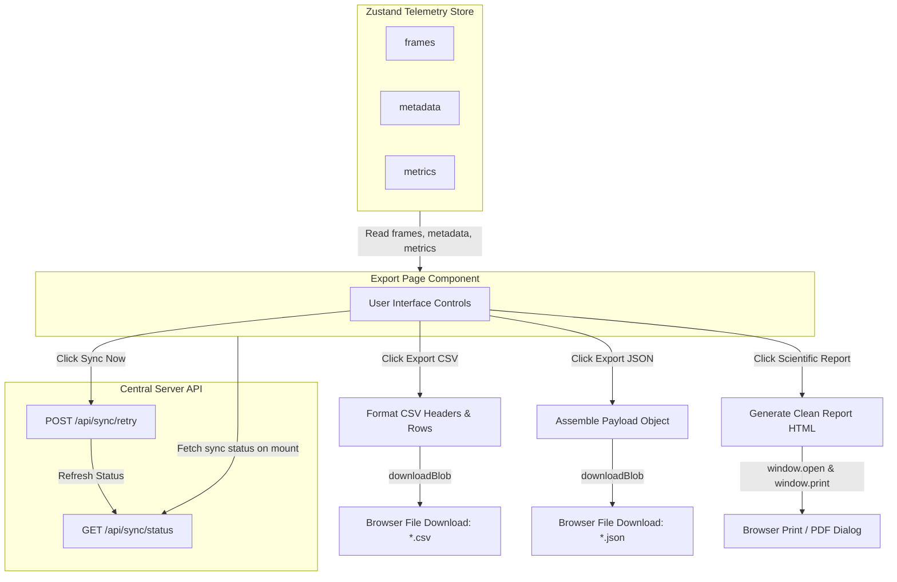
```mermaid
graph TD
    subgraph TelemetryStore[Zustand Telemetry Store]
        StoreFrames[frames]
        StoreMeta[metadata]
        StoreMetrics[metrics]
    end

    subgraph ExportPage[Export Page Component]
        UI[User Interface Controls]
    end

    subgraph ExternalBackend[Central Server API]
        SyncStatus[GET /api/sync/status]
        SyncRetry[POST /api/sync/retry]
    end

    TelemetryStore -->|Read frames, metadata, metrics| ExportPage
    ExportPage -->|Fetch sync status on mount| SyncStatus

    UI -->|Click Export CSV| CSVProc[Format CSV Headers & Rows]
    CSVProc -->|downloadBlob| CSVFile[Browser File Download: *.csv]

    UI -->|Click Export JSON| JSONProc[Assemble Payload Object]
    JSONProc -->|downloadBlob| JSONFile[Browser File Download: *.json]

    UI -->|Click Scientific Report| HTMLProc[Generate Clean Report HTML]
    HTMLProc -->|window.open & window.print| PrintDialog[Browser Print / PDF Dialog]

    UI -->|Click Sync Now| SyncRetry
    SyncRetry -->|Refresh Status| SyncStatus
```

---

# Level1 Telemetry Pipeline

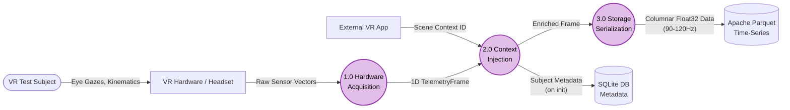
```mermaid
flowchart LR
    %% External Entities
    Subject([VR Test Subject])
    HMD[VR Hardware / Headset]
    App[External VR App]

    %% Processes
    Proc_Poll((1.0 Hardware<br/>Acquisition))
    Proc_Sync((2.0 Context<br/>Injection))
    Proc_Write((3.0 Storage<br/>Serialization))

    %% Data Stores
    DS_Meta[(SQLite DB<br/>Metadata)]
    DS_Parquet[(Apache Parquet<br/>Time-Series)]

    %% Flow
    Subject -- "Eye Gazes, Kinematics" --> HMD
    App -- "Scene Context ID" --> Proc_Sync
    HMD -- "Raw Sensor Vectors" --> Proc_Poll
    
    Proc_Poll -- "1D TelemetryFrame" --> Proc_Sync
    Proc_Sync -- "Enriched Frame" --> Proc_Write
    
    Proc_Sync -- "Subject Metadata<br/>(on init)" --> DS_Meta
    Proc_Write -- "Columnar Float32 Data<br/>(90-120Hz)" --> DS_Parquet

    %% Styling
    classDef process fill:#e1bee7,stroke:#8e24aa,stroke-width:2px,color:#000;
    class Proc_Poll,Proc_Sync,Proc_Write process;
```

---

# Local Cache Dataflow

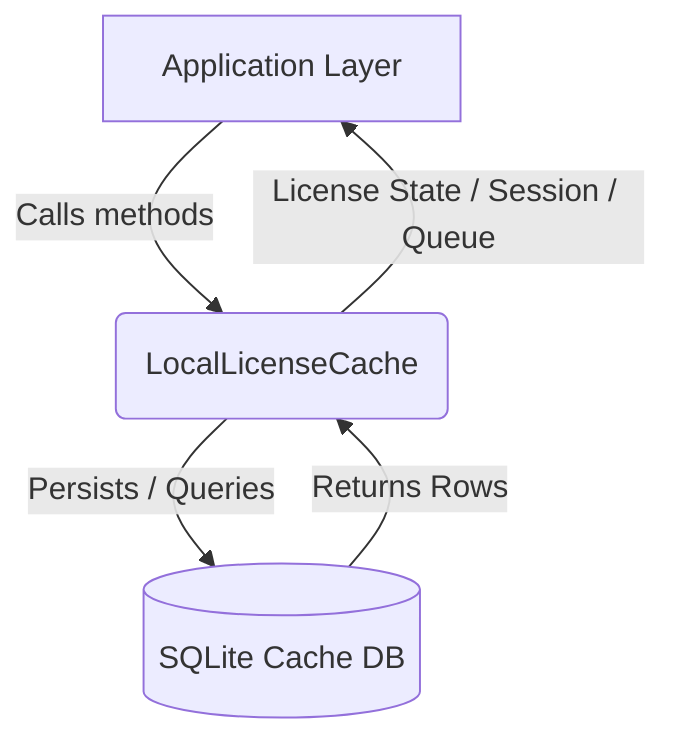
```mermaid
flowchart TD
    A[Application Layer] -->|Calls methods| B(LocalLicenseCache)
    B -->|Persists / Queries| C[(SQLite Cache DB)]
    C -->|Returns Rows| B
    B -->|License State / Session / Queue| A
```

---

# Parquet Schema Dictionary

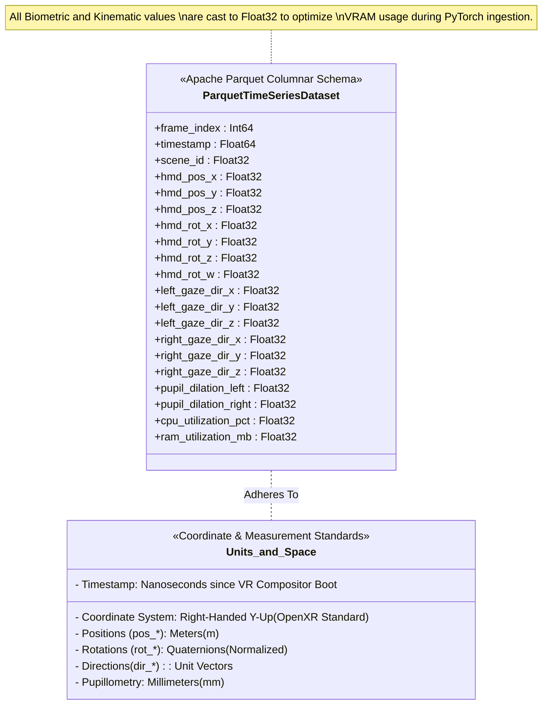
```mermaid
classDiagram
    class ParquetTimeSeriesDataset {
        <<Apache Parquet Columnar Schema>>
        +frame_index : Int64
        +timestamp : Float64
        +scene_id : Float32
        +hmd_pos_x : Float32
        +hmd_pos_y : Float32
        +hmd_pos_z : Float32
        +hmd_rot_x : Float32
        +hmd_rot_y : Float32
        +hmd_rot_z : Float32
        +hmd_rot_w : Float32
        +left_gaze_dir_x : Float32
        +left_gaze_dir_y : Float32
        +left_gaze_dir_z : Float32
        +right_gaze_dir_x : Float32
        +right_gaze_dir_y : Float32
        +right_gaze_dir_z : Float32
        +pupil_dilation_left : Float32
        +pupil_dilation_right : Float32
        +cpu_utilization_pct : Float32
        +ram_utilization_mb : Float32
    }
    
    note for ParquetTimeSeriesDataset "All Biometric and Kinematic values \nare cast to Float32 to optimize \nVRAM usage during PyTorch ingestion."
    
    class Units_and_Space {
        <<Coordinate & Measurement Standards>>
        - Coordinate System: Right-Handed Y-Up (OpenXR Standard)
        - Positions (pos_*): Meters (m)
        - Rotations (rot_*): Quaternions (Normalized)
        - Directions (dir_*): Unit Vectors
        - Pupillometry: Millimeters (mm)
        - Timestamp: Nanoseconds since VR Compositor Boot
    }
    
    ParquetTimeSeriesDataset .. Units_and_Space : Adheres To
```

---

# Parquet Writer Dataflow

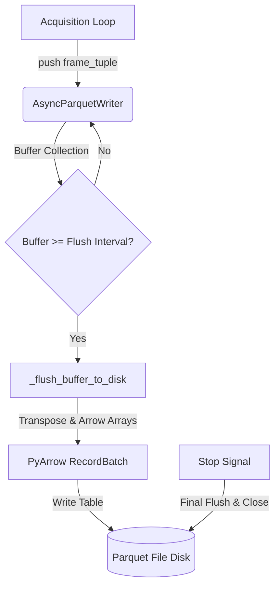
```mermaid
graph TD
    A[Acquisition Loop] -->|push frame_tuple| B(AsyncParquetWriter)
    B -->|Buffer Collection| C{Buffer >= Flush Interval?}
    C -->|Yes| D[_flush_buffer_to_disk]
    C -->|No| B
    D -->|Transpose & Arrow Arrays| E[PyArrow RecordBatch]
    E -->|Write Table| F[(Parquet File Disk)]
    G[Stop Signal] -->|Final Flush & Close| F
```

---

# Spatial Viewer Dataflow

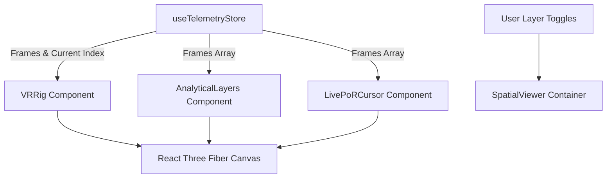
```mermaid
flowchart TD
    Store[useTelemetryStore] -->|Frames & Current Index| VRRig[VRRig Component]
    Store -->|Frames Array| AnalyticalLayers[AnalyticalLayers Component]
    Store -->|Frames Array| LivePoRCursor[LivePoRCursor Component]
    VRRig --> Canvas[React Three Fiber Canvas]
    AnalyticalLayers --> Canvas
    LivePoRCursor --> Canvas
    UI[User Layer Toggles] --> SpatialViewer[SpatialViewer Container]
```

---

# Synchronizer Dataflow

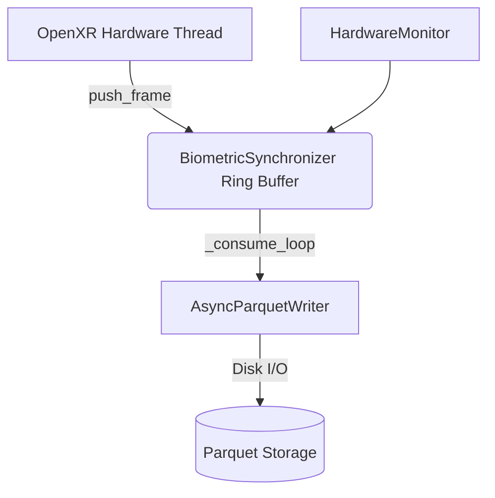
```mermaid
flowchart TD
    A[OpenXR Hardware Thread] -->|push_frame| B(BiometricSynchronizer Ring Buffer)
    B -->|_consume_loop| C[AsyncParquetWriter]
    C -->|Disk I/O| D[(Parquet Storage)]
    E[HardwareMonitor] --> B
```

---

# Telemetry Frame Dataflow

```mermaid
graph TD
    HW[Hardware Inputs: HMD, Controllers, Eye Tracker, Sensors] -->|Raw Data| TF[TelemetryFrame dataclass]
    TF -->|to_tuple()| PA[PyArrow Memory Tables]
    Drop[Hardware Drop / Lag] -->|create_empty()| TF
```

---

# Telemetryparser Dataflow

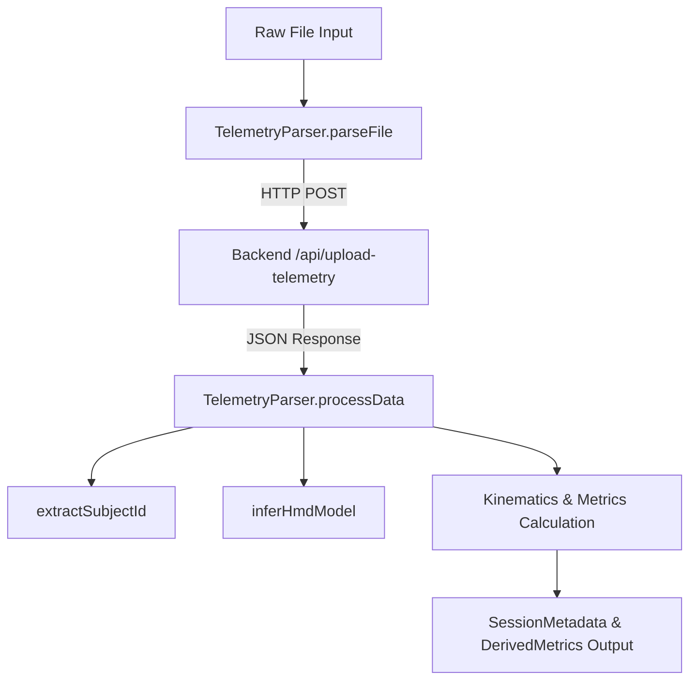
```mermaid
graph TD
    A[Raw File Input] --> B[TelemetryParser.parseFile]
    B -->|HTTP POST| C[Backend /api/upload-telemetry]
    C -->|JSON Response| D[TelemetryParser.processData]
    D --> E[extractSubjectId]
    D --> F[inferHmdModel]
    D --> G[Kinematics & Metrics Calculation]
    G --> H[SessionMetadata & DerivedMetrics Output]
```

---

# Udp Receiver Dataflow

```mermaid
graph TD
    A[Quest Pro Native Overlay] -->|64-byte UDP Packet| B(NativeQuestHarvesterProtocol)
    B -->|Check Payload Size| C{Size == 64?}
    C -->|No| D[Discard / Log Debug]
    C -->|Yes| E[struct.unpack Binary Payload]
    E --> F[Map to TelemetryFrame]
    F --> G[Normalize Confidences & Check Validity]
    G --> H[BiometricSynchronizer.push_frame]
    H --> I[(Downstream Processing / Parquet)]
```

---

# Usage Tracker Dataflow

```mermaid
graph TD
    A[App Component] -->|log_event| B(UsageTracker)
    B -->|Insert Event| C[(SQLite Database)]
```

---

---

## Folder & File Structure

Here is the layout of files and subfolders contained within this path:

```text
dataflow/
├── README.md
├── erd_metadata_schema.svg
├── level1_telemetry_pipeline.svg
└── parquet_schema_dictionary.svg
```