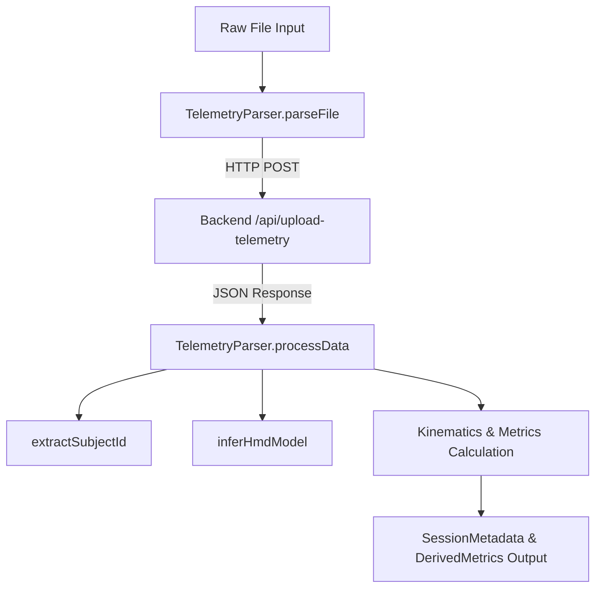

```mermaid
graph TD
    A[Raw File Input] --> B[TelemetryParser.parseFile]
    B -->|HTTP POST| C[Backend /api/upload-telemetry]
    C -->|JSON Response| D[TelemetryParser.processData]
    D --> E[extractSubjectId]
    D --> F[inferHmdModel]
    D --> G[Kinematics & Metrics Calculation]
    G --> H[SessionMetadata & DerivedMetrics Output]
```
