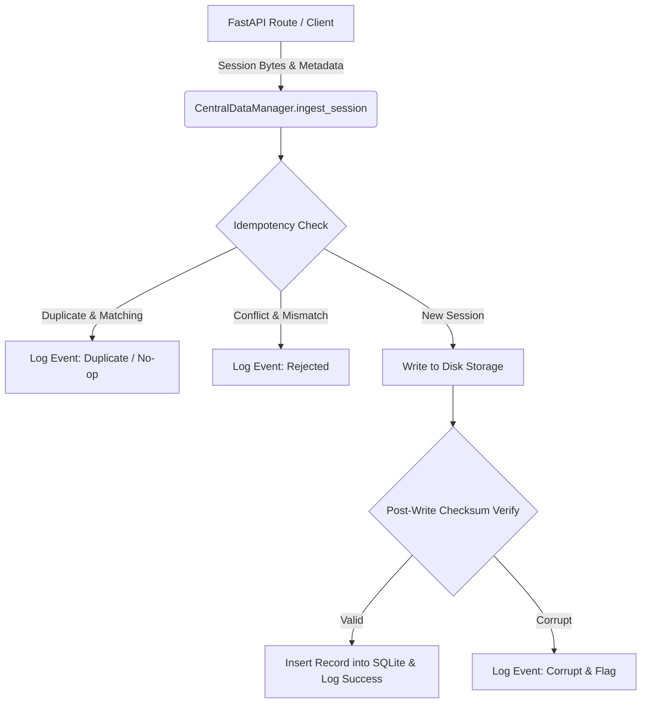

```mermaid
flowchart TD
    A[FastAPI Route / Client] -->|Session Bytes & Metadata| B(CentralDataManager.ingest_session)
    B --> C{Idempotency Check}
    C -->|Duplicate & Matching| D[Log Event: Duplicate / No-op]
    C -->|Conflict & Mismatch| E[Log Event: Rejected]
    C -->|New Session| F[Write to Disk Storage]
    F --> G{Post-Write Checksum Verify}
    G -->|Valid| H[Insert Record into SQLite & Log Success]
    G -->|Corrupt| I[Log Event: Corrupt & Flag]
```
