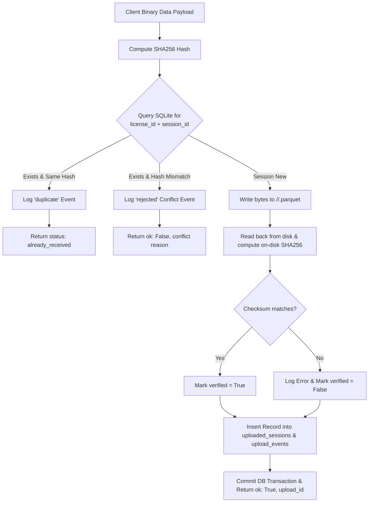

```mermaid
flowchart TD
    A[Client Binary Data Payload] --> B[Compute SHA256 Hash]
    B --> C{Query SQLite for
license_id + session_id}
    
    C -- Exists & Same Hash --> D[Log 'duplicate' Event]
    D --> E[Return status: already_received]
    
    C -- Exists & Hash Mismatch --> F[Log 'rejected' Conflict Event]
    F --> G[Return ok: False, conflict reason]
    
    C -- Session New --> H[Write bytes to <storage_root>/<license_id>/<session_id>.parquet]
    H --> I[Read back from disk & compute on-disk SHA256]
    I --> J{Checksum matches?}
    
    J -- Yes --> K[Mark verified = True]
    J -- No --> L[Log Error & Mark verified = False]
    
    K --> M[Insert Record into uploaded_sessions & upload_events]
    L --> M
    M --> N[Commit DB Transaction & Return ok: True, upload_id]
```