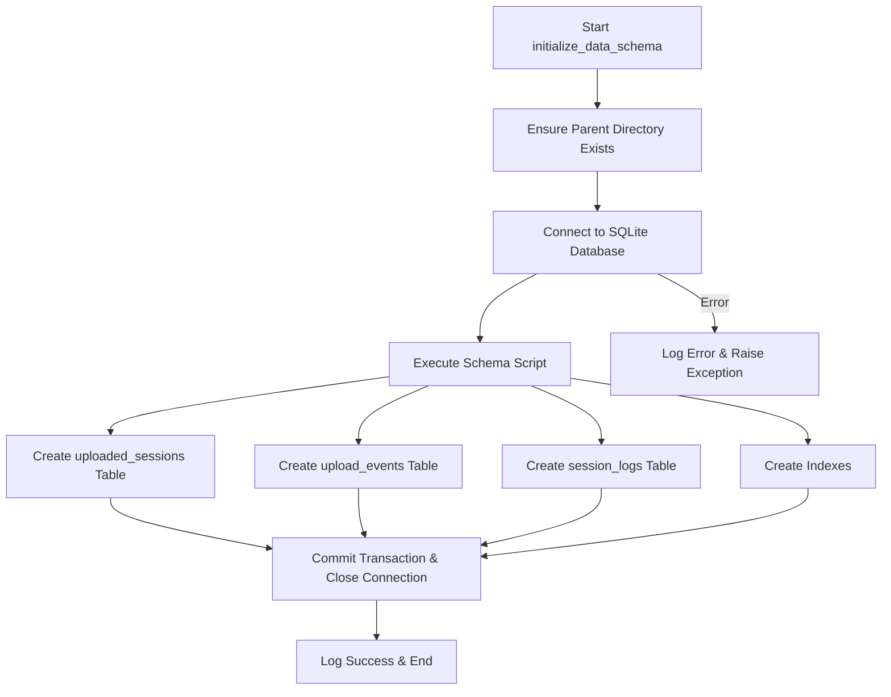

```mermaid
flowchart TD
    A[Start initialize_data_schema] --> B[Ensure Parent Directory Exists]
    B --> C[Connect to SQLite Database]
    C --> D[Execute Schema Script]
    D --> E[Create uploaded_sessions Table]
    D --> F[Create upload_events Table]
    D --> G[Create session_logs Table]
    D --> H[Create Indexes]
    E & F & G & H --> I[Commit Transaction & Close Connection]
    I --> J[Log Success & End]
    C -- Error --> K[Log Error & Raise Exception]
```