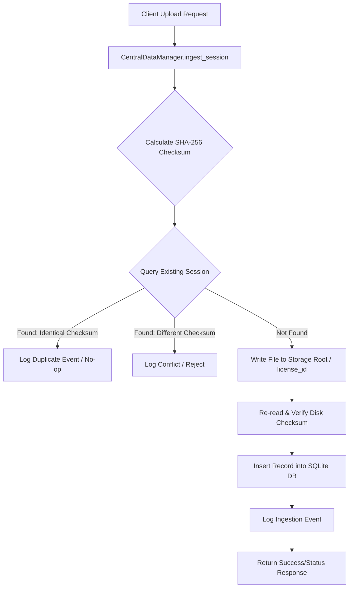

```mermaid
graph TD
    A[Client Upload Request] --> B[CentralDataManager.ingest_session]
    B --> C{Calculate SHA-256 Checksum}
    C --> D{Query Existing Session}
    D -->|Found: Identical Checksum| E[Log Duplicate Event / No-op]
    D -->|Found: Different Checksum| F[Log Conflict / Reject]
    D -->|Not Found| G[Write File to Storage Root / license_id]
    G --> H[Re-read & Verify Disk Checksum]
    H --> I[Insert Record into SQLite DB]
    I --> J[Log Ingestion Event]
    J --> K[Return Success/Status Response]
```