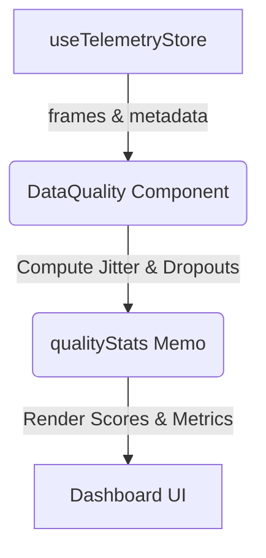

```mermaid
graph TD
    A[useTelemetryStore] -->|frames & metadata| B(DataQuality Component)
    B -->|Compute Jitter & Dropouts| C(qualityStats Memo)
    C -->|Render Scores & Metrics| D[Dashboard UI]
```
