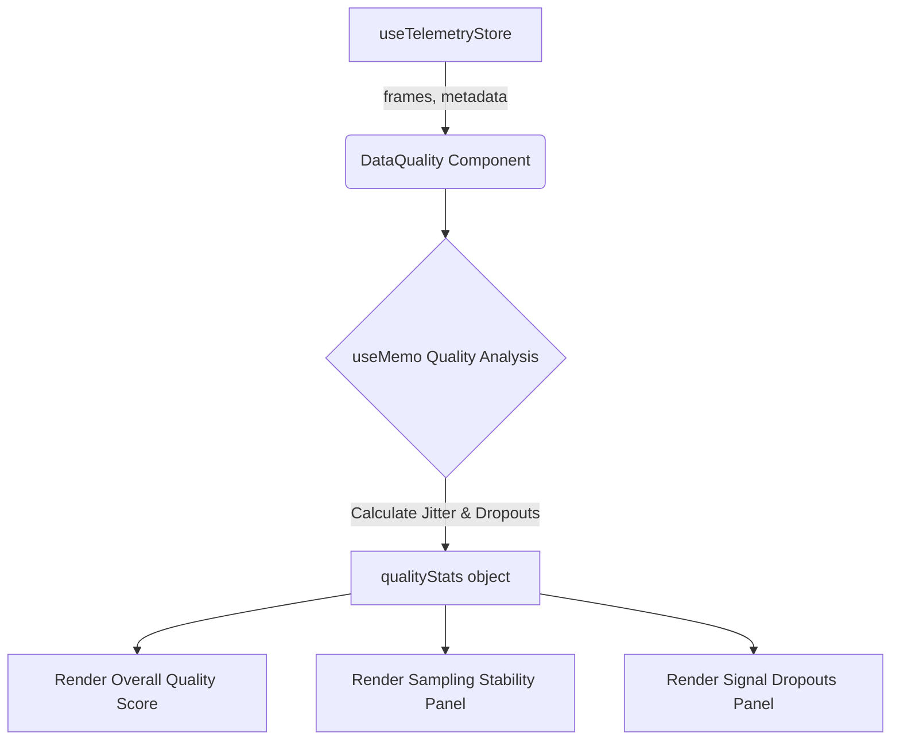

```mermaid
graph TD
    A[useTelemetryStore] -->|frames, metadata| B(DataQuality Component)
    B --> C{useMemo Quality Analysis}
    C -->|Calculate Jitter & Dropouts| D[qualityStats object]
    D --> E[Render Overall Quality Score]
    D --> F[Render Sampling Stability Panel]
    D --> G[Render Signal Dropouts Panel]
```