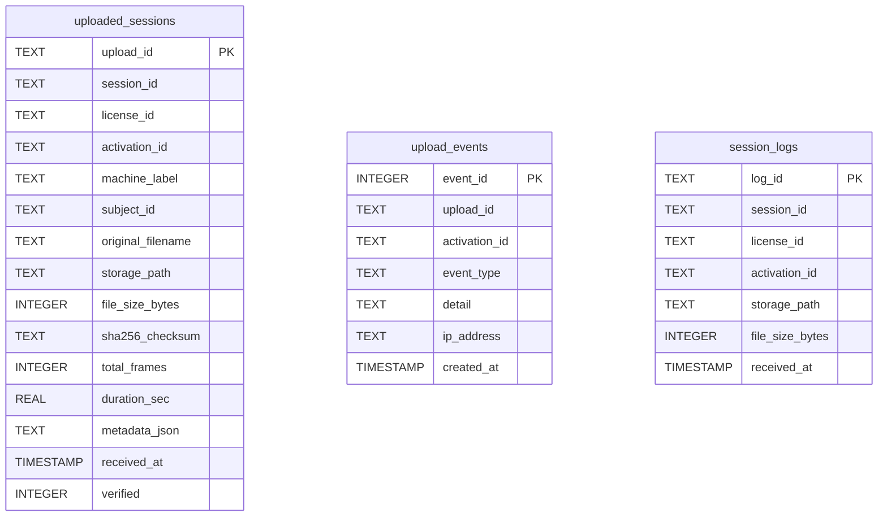

```mermaid
erDiagram
    uploaded_sessions {
        TEXT upload_id PK
        TEXT session_id
        TEXT license_id
        TEXT activation_id
        TEXT machine_label
        TEXT subject_id
        TEXT original_filename
        TEXT storage_path
        INTEGER file_size_bytes
        TEXT sha256_checksum
        INTEGER total_frames
        REAL duration_sec
        TEXT metadata_json
        TIMESTAMP received_at
        INTEGER verified
    }
    upload_events {
        INTEGER event_id PK
        TEXT upload_id
        TEXT activation_id
        TEXT event_type
        TEXT detail
        TEXT ip_address
        TIMESTAMP created_at
    }
    session_logs {
        TEXT log_id PK
        TEXT session_id
        TEXT license_id
        TEXT activation_id
        TEXT storage_path
        INTEGER file_size_bytes
        TIMESTAMP received_at
    }
```
