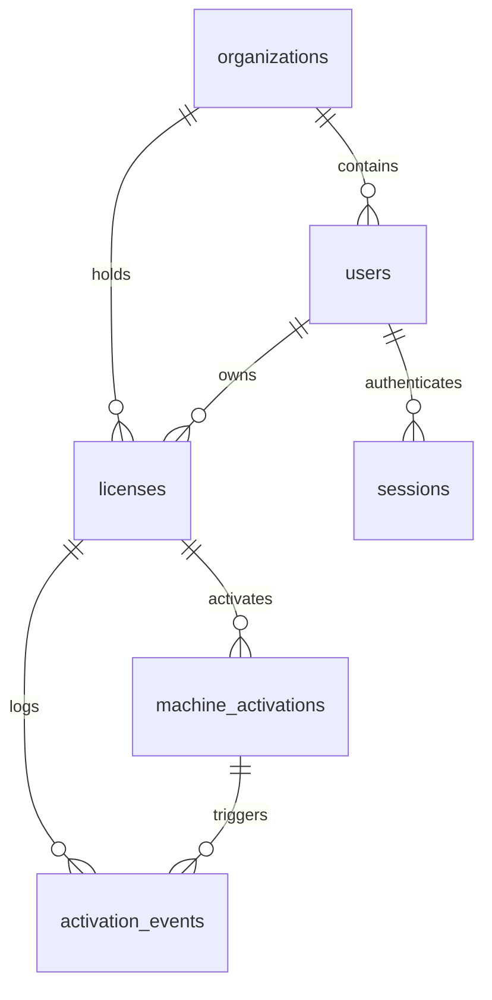

```mermaid
erDiagram
    organizations ||--o{ users : contains
    organizations ||--o{ licenses : holds
    users ||--o{ sessions : authenticates
    users ||--o{ licenses : owns
    licenses ||--o{ machine_activations : activates
    licenses ||--o{ activation_events : logs
    machine_activations ||--o{ activation_events : triggers
```
