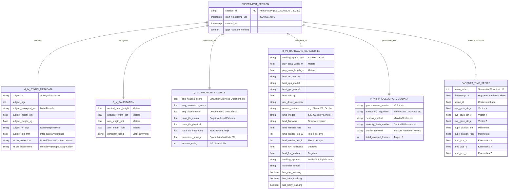

```mermaid
erDiagram
    %% SQLite Relational Data
    EXPERIMENT_SESSION ||--|| M_IV_STATIC_METADATA : contains
    EXPERIMENT_SESSION ||--|| C_V_CALIBRATION : configures
    EXPERIMENT_SESSION ||--|| Q_VI_SUBJECTIVE_LABELS : evaluated_by
    EXPERIMENT_SESSION ||--|| H_VII_HARDWARE_CAPABILITIES : executed_on
    EXPERIMENT_SESSION ||--|| P_VIII_PROCESSING_METADATA : processed_with
    
    %% Implicit relation to Parquet
    EXPERIMENT_SESSION ||--o{ PARQUET_TIME_SERIES : "Session ID Match"

    EXPERIMENT_SESSION {
        string session_id PK "Primary Key (e.g., 20260626_130232)"
        timestamp start_timestamp_utc "ISO 8601 UTC"
        timestamp created_at
        boolean gdpr_consent_verified
    }

    M_IV_STATIC_METADATA {
        string subject_id "Anonymized UUID"
        int subject_age
        string subject_biological_sex "Male/Female"
        float subject_height_cm
        float subject_weight_kg
        string subject_vr_exp "None/Beginner/Pro"
        float subject_ipd_mm "Inter-pupillary distance"
        string vision_correction "None/Glasses/Contact Lenses"
        string vision_impairment "Myopia/Hyperopia/Astigmatism"
    }

    C_V_CALIBRATION {
        float neutral_head_height "Meters"
        float shoulder_width_est "Meters"
        float arm_length_left "Meters"
        float arm_length_right "Meters"
        string dominant_hand "Left/Right/Ambi"
    }

    Q_VI_SUBJECTIVE_LABELS {
        float ssq_nausea_score "Simulator Sickness Questionnaire"
        float ssq_oculomotor_score
        float ssq_disorientation "Dezorientáció pontszáma"
        float nasa_tlx_mental "Cognitive Load Estimate"
        float nasa_tlx_physical
        float nasa_tlx_frustration "Frusztráció szintje"
        float perceived_temp_c "Szoba hőmérséklete °C"
        int session_rating "1-5 Likert skála"
    }

    H_VII_HARDWARE_CAPABILITIES {
        string tracking_space_type "STAGE/LOCAL"
        float play_area_width_m "Meters"
        float play_area_length_m "Meters"
        string host_os_version
        string host_cpu_model
        string host_gpu_model
        float host_ram_gb
        string gpu_driver_version
        string openxr_runtime "e.g., SteamVR, Oculus"
        string hmd_model "e.g., Quest Pro, Index"
        string hmd_firmware "Firmware version"
        float hmd_refresh_rate "Hz"
        int hmd_render_res_w "Pixels per eye"
        int hmd_render_res_h "Pixels per eye"
        float hmd_fov_horizontal "Degrees"
        float hmd_fov_vertical "Degrees"
        string tracking_system "Inside-Out, Lighthouse"
        string controller_model
        boolean has_eye_tracking
        boolean has_face_tracking
        boolean has_body_tracking
    }
    
    P_VIII_PROCESSING_METADATA {
        string preprocessor_version "v1.2.4 etc."
        string smoothing_algorithm "Butterworth Low-Pass etc."
        string scaling_method "MinMaxScaler etc."
        string velocity_deriv_method "Central Difference etc."
        string outlier_removal "Z-Score / Isolation Forest"
        int total_dropped_frames "Target: 0"
    }

    %% Apache Parquet Columnar Data (Abbreviated Time-Series)
    PARQUET_TIME_SERIES {
        int frame_index "Sequential Monotonic ID"
        float timestamp_ns "High-Res Hardware Timer"
        float scene_id "Contextual Label"
        float eye_gaze_dir_x "Vector X"
        float eye_gaze_dir_y "Vector Y"
        float eye_gaze_dir_z "Vector Z"
        float pupil_dilation_left "Millimeters"
        float pupil_dilation_right "Millimeters"
        float hmd_pos_x "Kinematics X"
        float hmd_pos_y "Kinematics Y"
        float hmd_pos_z "Kinematics Z"
    }
```
