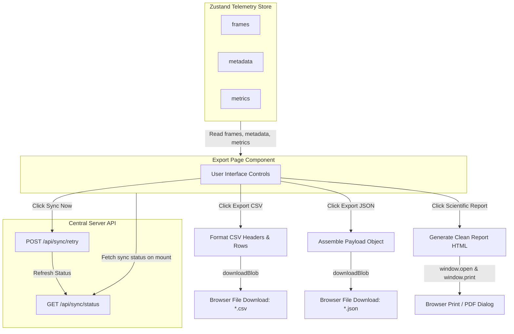

```mermaid
graph TD
    subgraph TelemetryStore[Zustand Telemetry Store]
        StoreFrames[frames]
        StoreMeta[metadata]
        StoreMetrics[metrics]
    end

    subgraph ExportPage[Export Page Component]
        UI[User Interface Controls]
    end

    subgraph ExternalBackend[Central Server API]
        SyncStatus[GET /api/sync/status]
        SyncRetry[POST /api/sync/retry]
    end

    TelemetryStore -->|Read frames, metadata, metrics| ExportPage
    ExportPage -->|Fetch sync status on mount| SyncStatus

    UI -->|Click Export CSV| CSVProc[Format CSV Headers & Rows]
    CSVProc -->|downloadBlob| CSVFile[Browser File Download: *.csv]

    UI -->|Click Export JSON| JSONProc[Assemble Payload Object]
    JSONProc -->|downloadBlob| JSONFile[Browser File Download: *.json]

    UI -->|Click Scientific Report| HTMLProc[Generate Clean Report HTML]
    HTMLProc -->|window.open & window.print| PrintDialog[Browser Print / PDF Dialog]

    UI -->|Click Sync Now| SyncRetry
    SyncRetry -->|Refresh Status| SyncStatus
```