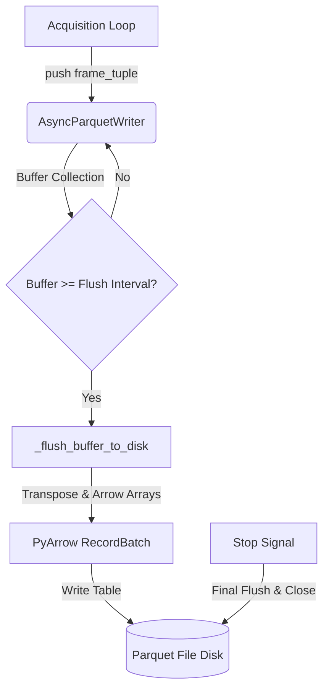

```mermaid
graph TD
    A[Acquisition Loop] -->|push frame_tuple| B(AsyncParquetWriter)
    B -->|Buffer Collection| C{Buffer >= Flush Interval?}
    C -->|Yes| D[_flush_buffer_to_disk]
    C -->|No| B
    D -->|Transpose & Arrow Arrays| E[PyArrow RecordBatch]
    E -->|Write Table| F[(Parquet File Disk)]
    G[Stop Signal] -->|Final Flush & Close| F
```
