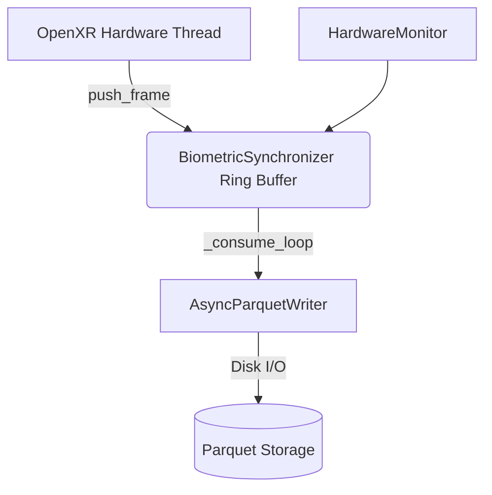

```mermaid
flowchart TD
    A[OpenXR Hardware Thread] -->|push_frame| B(BiometricSynchronizer Ring Buffer)
    B -->|_consume_loop| C[AsyncParquetWriter]
    C -->|Disk I/O| D[(Parquet Storage)]
    E[HardwareMonitor] --> B
```