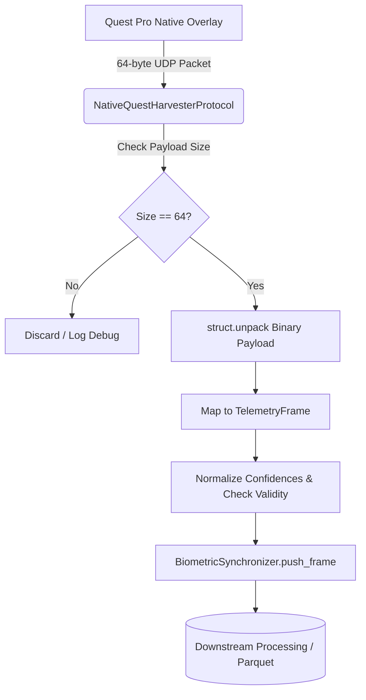

```mermaid
graph TD
    A[Quest Pro Native Overlay] -->|64-byte UDP Packet| B(NativeQuestHarvesterProtocol)
    B -->|Check Payload Size| C{Size == 64?}
    C -->|No| D[Discard / Log Debug]
    C -->|Yes| E[struct.unpack Binary Payload]
    E --> F[Map to TelemetryFrame]
    F --> G[Normalize Confidences & Check Validity]
    G --> H[BiometricSynchronizer.push_frame]
    H --> I[(Downstream Processing / Parquet)]
```