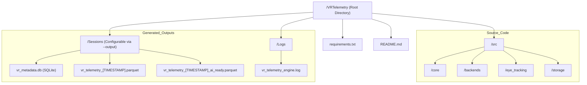

```mermaid
graph TD
    Root["/VRTelemetry (Root Directory)"]
    
    subgraph Source_Code
        Src["/src"]
        Core["/core"]
        BE["/backends"]
        Eye["/eye_tracking"]
        Storage["/storage"]
        Src --> Core & BE & Eye & Storage
    end
    
    subgraph Generated_Outputs
        Sess["/Sessions (Configurable via --output)"]
        SQL["vr_metadata.db (SQLite)"]
        ParquetRaw["vr_telemetry_[TIMESTAMP].parquet"]
        ParquetAI["vr_telemetry_[TIMESTAMP]_ai_ready.parquet"]
        Logs["/Logs"]
        LogFile["vr_telemetry_engine.log"]
        
        Sess --> SQL
        Sess --> ParquetRaw
        Sess --> ParquetAI
        Logs --> LogFile
    end
    
    Root --> Src
    Root --> Sess
    Root --> Logs
    Root --> Requirements["requirements.txt"]
    Root --> Readme["README.md"]
```
