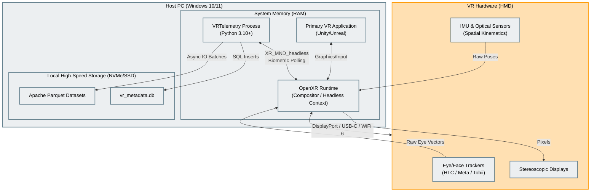

```mermaid
flowchart TB
    subgraph HostPC ["Host PC (Windows 10/11)"]
        direction TB
        
        subgraph RAM ["System Memory (RAM)"]
            AppProcess["Primary VR Application<br/>(Unity/Unreal)"]
            VRTProcess["VRTelemetry Process<br/>(Python 3.10+)"]
            XRRuntime["OpenXR Runtime<br/>(Compositor / Headless Context)"]
        end
        
        subgraph Disk ["Local High-Speed Storage (NVMe/SSD)"]
            ParquetFiles["Apache Parquet Datasets"]
            SQLiteDB["vr_metadata.db"]
        end
        
        AppProcess <-->|Graphics/Input| XRRuntime
        VRTProcess <-->|XR_MND_headless<br/>Biometric Polling| XRRuntime
        
        VRTProcess -->|Async IO Batches| ParquetFiles
        VRTProcess -->|SQL Inserts| SQLiteDB
    end

    subgraph VRHardware ["VR Hardware (HMD)"]
        Sensors["Eye/Face Trackers<br/>(HTC / Meta / Tobii)"]
        IMU["IMU & Optical Sensors<br/>(Spatial Kinematics)"]
        Display["Stereoscopic Displays"]
    end
    
    XRRuntime <-->|DisplayPort / USB-C / WiFi 6| VRHardware
    Sensors -->|Raw Eye Vectors| XRRuntime
    IMU -->|Raw Poses| XRRuntime
    XRRuntime -->|Pixels| Display
    
    classDef node fill:#eceff1,stroke:#607d8b,stroke-width:2px,color:#000;
    classDef hardware fill:#ffe0b2,stroke:#ff9800,stroke-width:2px,color:#000;
    class HostPC,RAM,Disk node;
    class VRHardware hardware;
```
