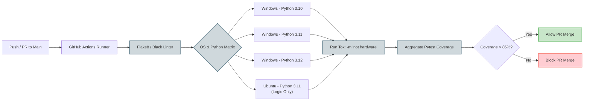

```mermaid
flowchart LR
    Commit["Push / PR to Main"] --> GH_Actions["GitHub Actions Runner"]
    GH_Actions --> Linting["Flake8 / Black Linter"]
    Linting --> Matrix{"OS & Python Matrix"}
    Matrix --> Win310["Windows - Python 3.10"]
    Matrix --> Win311["Windows - Python 3.11"]
    Matrix --> Win312["Windows - Python 3.12"]
    Matrix --> Lin311["Ubuntu - Python 3.11<br/>(Logic Only)"]
    Win310 --> ToxRun["Run Tox: -m 'not hardware'"]
    Win311 --> ToxRun
    Win312 --> ToxRun
    Lin311 --> ToxRun
    ToxRun --> Aggregate["Aggregate Pytest Coverage"]
    Aggregate --> Status{"Coverage > 85%?"}
    Status -- Yes --> Merge["Allow PR Merge"]
    Status -- No --> Block["Block PR Merge"]
    classDef pipeline fill:#cfd8dc,stroke:#607d8b,stroke-width:2px;
    classDef success fill:#c8e6c9,stroke:#4caf50,stroke-width:2px;
    classDef fail fill:#ffcdd2,stroke:#f44336,stroke-width:2px;
    class Linting,Matrix,ToxRun,Aggregate pipeline;
    class Merge success;
    class Block fail;
```

