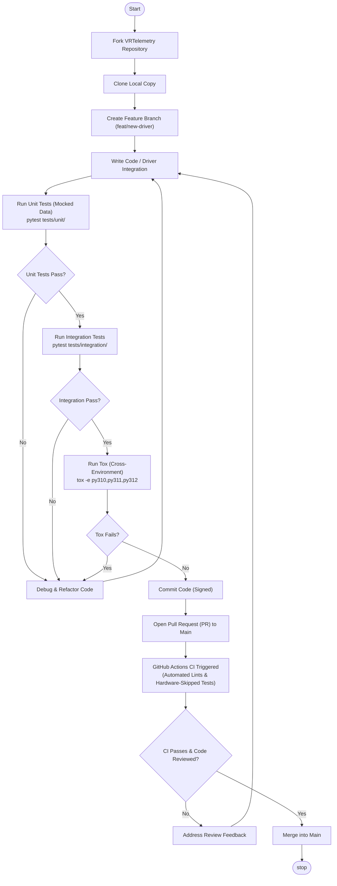

```mermaid
flowchart TD
    Start(["Start"]) --> Fork["Fork VRTelemetry Repository"]
    Fork --> Clone["Clone Local Copy"]
    Clone --> Branch["Create Feature Branch (feat/new-driver)"]
    Branch --> Write["Write Code / Driver Integration"]
    Write --> Unit["Run Unit Tests (Mocked Data)<br/>pytest tests/unit/"]
    Unit --> UnitCheck{"Unit Tests Pass?"}
    UnitCheck -- No --> Debug["Debug & Refactor Code"] --> Write
    UnitCheck -- Yes --> Integ["Run Integration Tests<br/>pytest tests/integration/"]
    Integ --> IntegCheck{"Integration Pass?"}
    IntegCheck -- No --> Debug
    IntegCheck -- Yes --> Tox["Run Tox (Cross-Environment)<br/>tox -e py310,py311,py312"]
    Tox --> ToxCheck{"Tox Fails?"}
    ToxCheck -- Yes --> Debug
    ToxCheck -- No --> Commit["Commit Code (Signed)"]
    Commit --> PR["Open Pull Request (PR) to Main"]
    PR --> CI["GitHub Actions CI Triggered<br/>(Automated Lints & Hardware-Skipped Tests)"]
    CI --> CICheck{"CI Passes & Code Reviewed?"}
    CICheck -- No --> Feedback["Address Review Feedback"] --> Write
    CICheck -- Yes --> Merge["Merge into Main"]
    Merge --> Stop(["stop"])
```

