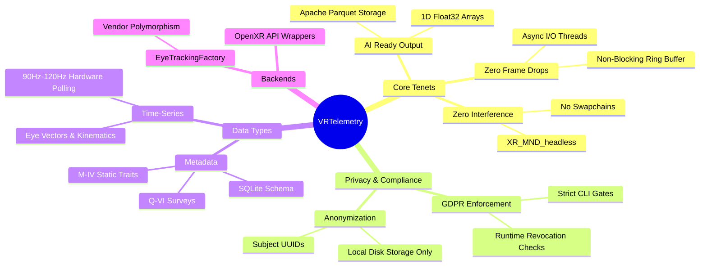

```mermaid
mindmap
  root((VRTelemetry))
    Core Tenets
      Zero Frame Drops
        Async I/O Threads
        Non-Blocking Ring Buffer
      Zero Interference
        XR_MND_headless
        No Swapchains
      AI Ready Output
        1D Float32 Arrays
        Apache Parquet Storage
    Privacy & Compliance
      GDPR Enforcement
        Strict CLI Gates
        Runtime Revocation Checks
      Anonymization
        Subject UUIDs
        Local Disk Storage Only
    Data Types
      Metadata
        SQLite Schema
        M-IV Static Traits
        Q-VI Surveys
      Time-Series
        90Hz-120Hz Hardware Polling
        Eye Vectors & Kinematics
    Backends
      OpenXR API Wrappers
      EyeTrackingFactory
        Vendor Polymorphism
```
