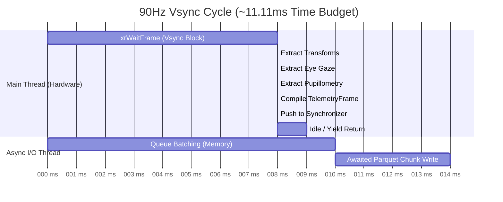

```mermaid
gantt
    title 90Hz Vsync Cycle (~11.11ms Time Budget)
    dateFormat  S
    axisFormat  %L ms
    
    section Main Thread (Hardware)
    xrWaitFrame (Vsync Block) :a1, 0, 8.5ms
    Extract Transforms        :a2, after a1, 0.5ms
    Extract Eye Gaze          :a3, after a2, 0.5ms
    Extract Pupillometry      :a4, after a3, 0.3ms
    Compile TelemetryFrame    :a5, after a4, 0.2ms
    Push to Synchronizer      :a6, after a5, 0.1ms
    Idle / Yield Return       :a7, after a6, 1.0ms
    
    section Async I/O Thread
    Queue Batching (Memory)   :b1, 0, 10.0ms
    Awaited Parquet Chunk Write :b2, after b1, 4.0ms
    
    %% Visual Markers
    %% 11.11ms boundary represents the hard deadline before a frame drop occurs
```
