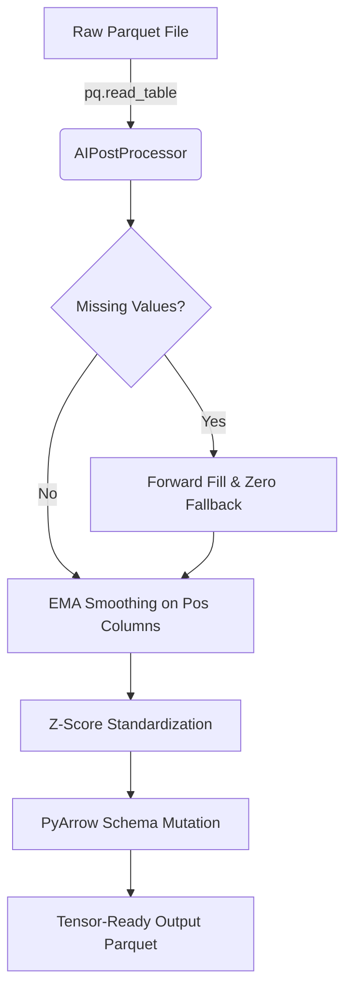

```mermaid
graph TD
    A[Raw Parquet File] -->|pq.read_table| B(AIPostProcessor)
    B --> C{Missing Values?}
    C -->|Yes| D[Forward Fill & Zero Fallback]
    C -->|No| E[EMA Smoothing on Pos Columns]
    D --> E
    E --> F[Z-Score Standardization]
    F --> G[PyArrow Schema Mutation]
    G --> H[Tensor-Ready Output Parquet]
```
