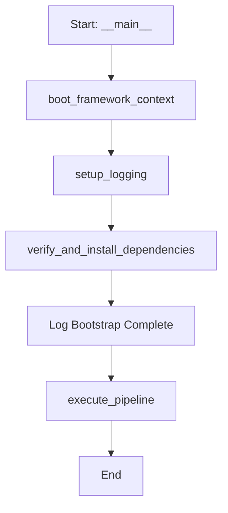

```mermaid
flowchart TD
    A[Start: __main__] --> B[boot_framework_context]
    B --> C[setup_logging]
    C --> D[verify_and_install_dependencies]
    D --> E[Log Bootstrap Complete]
    E --> F[execute_pipeline]
    F --> G[End]
```